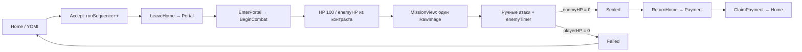
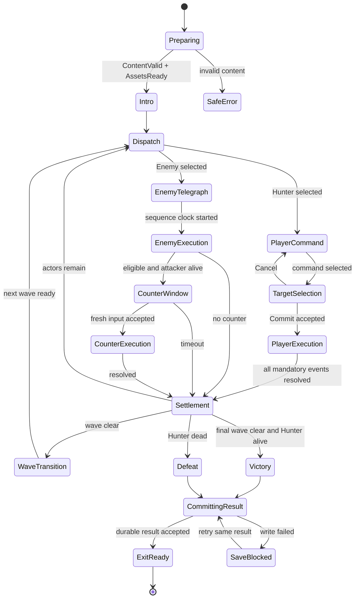
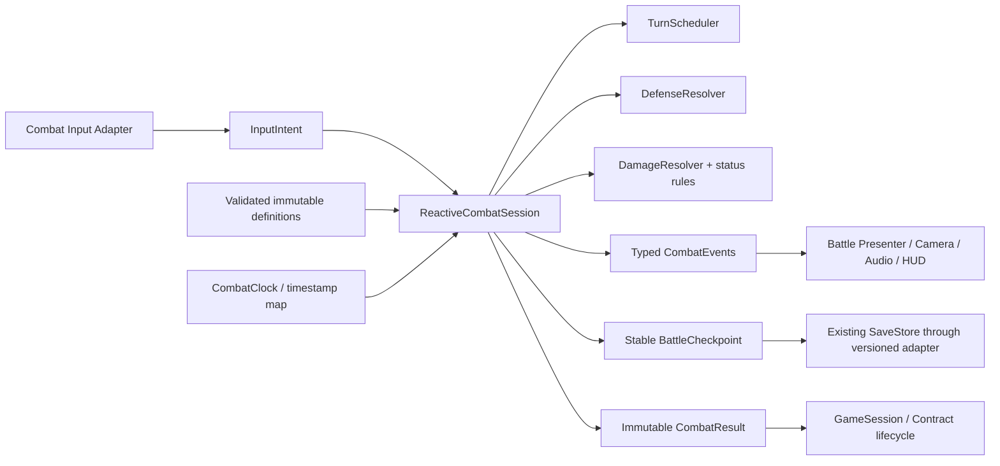

# «Пропасть»: исследование и спецификация реактивной пошаговой боёвки ROKAS

19–20 сентября 2026 · финальная сверка 20 сентября · проект для обсуждения · GDD + TDD + аудит + UX + content pipeline + план миграции

**Статус:** исследование завершено; предложенная система не реализована и не прошла playtest. Числа новой системы — **PLAYTEST STARTING VALUES**, а не утверждённый баланс. Планы не являются разрешением на реализацию.

**Исследованная основа:** `D:/Rokas/Rokas`, ветка `integration/rokas-unified`, HEAD `fd5d99afd0ecb04c20edfdb8ac5916a4be41b139`. Серверная актуальность ветки не проверялась: для локального аудита достаточно зафиксированного дерева, но для будущей интеграции нужен новый ref audit.

**Граница работы:** чтение исходников, данных, конфигурации, исторических доказательств, исследование первичных источников, статический asset validator, расчётные модели и документы. Unity не запускалась, сцены не открывались, профиль игрока не читался, продуктовый код и ассеты не менялись. Новый VERIFIED checkpoint не создавался. Этот документ не является handoff сборки для ручного QA.

**Как читать:** главы 1–8 — решение и его основания; 9–32 — правила; 33–45 — производство и архитектура; 46–56 — надёжность и инструменты; 57–60 — примеры боёв; 61–66 — внедрение, проверки и решения. Отдельный [план реализации](D:/Rokas/Rokas/Docs/Superpowers/plans/2026-09-19-reactive-combat.md) содержит зависимости, файлы, контракты и критерии приёмки. Все предложения ниже относятся к новому режиму `ReactiveTurns`; действующая Combat 2 сохраняется до отдельно утверждённого переключения.

**Документы финальной сверки:** [численный аудит](D:/Rokas/Rokas/Docs/Research/2026-09-19-reactive-combat/Numerical-Consistency-Audit.md) · [точный контракт правил](D:/Rokas/Rokas/Docs/Research/2026-09-19-reactive-combat/Combat-Rule-Contract.md) · [план реализации](D:/Rokas/Rokas/Docs/Superpowers/plans/2026-09-19-reactive-combat.md) · [мастер-промпт Astra](D:/Rokas/Rokas/Docs/Research/2026-09-19-reactive-combat/ASTRA-MASTER-IMPLEMENTATION-PROMPT.md).

**Обозначения:** FACT / VERIFIED CURRENT CODE — проверенный факт; CALCULATION — расчёт при названных допущениях; DESIGN DECISION — предлагаемый обязательный контракт нового режима; PROPOSAL / HYPOTHESIS — технический вариант или гипотеза для будущей проверки. Пользователь ещё не разрешал реализацию.

## 1. Executive Summary

Рекомендую **CTB с ограничением непрерывного вражеского давления**, одного охотника, три обычных активных слота и четвёртый проверяемый слот для специальных составов. Стратегический ход не ограничен секундомером. После выбора команды охотник сближается с целью, исполняет короткую атаку и возвращается. На вражеском ходу каждый контакт имеет отдельное событие защиты: Dodge, Parry или Perfect Parry.

Портал — один encounter, но он содержит несколько волн. Двадцать врагов одновременно здесь не нужны: они увеличивают время защиты, сложность выбора цели и производство постановки быстрее, чем глубину решений. Портал с двадцатью противниками предлагается как редкий gauntlet из шести волн; его продолжительность честно оценивается в несколько минут, а не в обычные 40 секунд.

Самобытность: ёкаи, разрушение их **Печати**, короткая ручная контратака, предсказуемые мутации портала между волнами и сохранение AP внутри портала. У игрока возникает выбор: потратить ресурс сейчас на опасного врага или сохранить его для следующей волны. Не требуется переносить чужую party system, свободное прицеливание, десятки статов или восемь QTE в каждой своей атаке.

Первый интегрированный vertical slice: существующий портал и контракт → один охотник и один ёкай → команда Basic/один Skill/Defend → одна трёхударная серия с отдельными защитами → AP/Seal Break → победа/поражение → прежнее возвращение/оплата. Сначала доказать справедливость тайминга, читаемость и сохранение прогресса; затем расширять до трёх врагов, волн и босса.

Главный технический риск — не поиск формулы урона. В канонической игре нет готового боевого персонажа с набором анимаций, а ввод опрашивается по кадрам. Кинематографическая постановка и точный ввод требуют отдельных проверяемых этапов. Существующий lane-прототип даёт полезные идеи жизненного цикла и арены, но не готовую пошаговую систему.

## 2. Current Combat Audit

### 2.1. Среда и достоверность

| Область | Подтверждённое состояние | Доказательство |
|---|---|---|
| Движок | Unity 6000.3.19f1, revision 7689f4515d75 | [ProjectVersion](D:/Rokas/Rokas/ProjectSettings/ProjectVersion.txt:1) |
| Язык / домен | C#, сборка Rokas.Core без UnityEngine | [Core.asmdef](D:/Rokas/Rokas/Assets/Rokas/Scripts/Core/Rokas.Core.asmdef:1) |
| Presentation | Unity uGUI, UI/TMP, Yarn, Video; зависимость от Core | [Presentation.asmdef](D:/Rokas/Rokas/Assets/Rokas/Scripts/Presentation/Rokas.Presentation.asmdef:1) |
| Рендер | Built-in: SRP не заявлен, локальный GraphicsSettings содержит нулевой pipeline | [manifest](D:/Rokas/Rokas/Packages/manifest.json:1), [GraphicsSettings](D:/Rokas/Rokas/ProjectSettings/GraphicsSettings.asset:40) |
| Ввод | Legacy Input, activeInputHandler=0, StandaloneInputModule; Input System отсутствует в manifest | [ProjectSettings](D:/Rokas/Rokas/ProjectSettings/ProjectSettings.asset:27), [Bootstrap](D:/Rokas/Rokas/Assets/Rokas/Scripts/Presentation/RokasBootstrap.cs:96) |
| Запуск | Одна включённая сцена Rokas.unity; Bootstrap создаёт runtime UI, видео, меню/VN и Home | [Build Settings](D:/Rokas/Rokas/ProjectSettings/EditorBuildSettings.asset:7), [Bootstrap.Start](D:/Rokas/Rokas/Assets/Rokas/Scripts/Presentation/RokasBootstrap.cs:36) |
| Целевая платформа | Подтверждён Windows x64 build path; 1920×1080 authored UI, runtime target 60 FPS | [RokasBuild.BuildWindows](D:/Rokas/Rokas/Assets/Rokas/Scripts/Editor/RokasBuild.cs:63), [Bootstrap](D:/Rokas/Rokas/Assets/Rokas/Scripts/Presentation/RokasBootstrap.cs:102) |
| Пакеты | Yarn Spinner v3.1.2, Test Framework 1.4.6, uGUI 2.0.0, стандартные модули | [manifest](D:/Rokas/Rokas/Packages/manifest.json:1) |
| Unity MCP | В доступных инструментах сессии Unity MCP нет; в manifest провайдер не заявлен | Инвентаризация инструментов и manifest; состояние открытого Editor не установлено |
| Сетевая игра | В просмотренных first-party scripts и manifest сетевой gameplay не обнаружен | Это граница аудита, а не обещание будущих платформ |

В начале работы присутствовали локальная правка ProjectVersion и 26 untracked файлов: настройки/lockfile/meta, прежние документы и пользовательские update/rollback scripts. Их содержимое зафиксировано SHA-256 для проверки сохранности. Они не относятся к этому исследованию и не исправлялись.

Важная документационная коллизия: README ещё описывает `development` и автоматический урон. Это противоречит текущему коду и AGENTS. Для актуального workflow источником является [AGENTS.md](D:/Rokas/Rokas/AGENTS.md:1), а для фактических правил — исходники. Старые инструкции не исполнялись.

### 2.2. Как бой действительно работает

| Система | Реализация / точное место | Вывод для новой системы |
|---|---|---|
| Encounter | Один ContractDefinition, один enemyId и один enemyHp | [ContractDefinition](D:/Rokas/Rokas/Assets/Rokas/Scripts/Core/ContractDefinition.cs:6), [SaveData](D:/Rokas/Rokas/Assets/Rokas/Scripts/Core/State.cs:29). Списка combatants нет |
| Вход | GameSession.EnterPortal → ContractService.BeginCombat → Combat.ResetEncounter | [EnterPortal](D:/Rokas/Rokas/Assets/Rokas/Scripts/Core/GameSession.cs:109), [BeginCombat](D:/Rokas/Rokas/Assets/Rokas/Scripts/Core/ContractService.cs:35) |
| Инициализация HP | enemyHp=contract.enemyHealth; playerHp=100; таймеры сбрасываются | BeginCombat, строки 43–50 |
| «Спавн» | MissionView создаёт RawImage FacelessCommuter, а не enemy prefab / AI entity | [MissionView.Build](D:/Rokas/Rokas/Assets/Rokas/Scripts/Presentation/MissionView.cs:61) |
| Выбор цели | Единственный прозрачный EnemyAttack UI surface | [CombatHud](D:/Rokas/Rokas/Assets/Rokas/Scripts/Presentation/CombatHud.cs:22). Target ID в команде отсутствует |
| Атака игрока | ЛКМ release; tap, удержание и combo; HP меняет только CombatService | [Begin/ReleaseAttack](D:/Rokas/Rokas/Assets/Rokas/Scripts/Core/CombatService.cs:81), [ClickAttack](D:/Rokas/Rokas/Assets/Rokas/Scripts/Core/CombatService.cs:112) |
| Формула | clickDamage × weapon multiplier × множитель приёма | [Strike](D:/Rokas/Rokas/Assets/Rokas/Scripts/Core/CombatService.cs:241), [Economy multiplier](D:/Rokas/Rokas/Assets/Rokas/Scripts/Core/EconomyService.cs:17) |
| Вражеская атака | Один enemyTimer; по истечении DamagePlayer; далее ScheduleAttack | [Tick](D:/Rokas/Rokas/Assets/Rokas/Scripts/Core/CombatService.cs:189) |
| AI / фазы | HP thresholds 2/3 и 1/3, чередование tempo по attackSequence | [EnemyPhase](D:/Rokas/Rokas/Assets/Rokas/Scripts/Core/CombatService.cs:48), [ScheduleAttack](D:/Rokas/Rokas/Assets/Rokas/Scripts/Core/CombatService.cs:234). Это не универсальное дерево поведения |
| Защита | Dodge/Deflect сравнивают оставшийся timer с окном .42/.14 с; успех сразу планирует следующий удар | [Defend](D:/Rokas/Rokas/Assets/Rokas/Scripts/Core/CombatService.cs:129), [Tuning](D:/Rokas/Rokas/Assets/Rokas/Scripts/Core/CombatTuning.cs:23) |
| Печать | Seal 100→0, пауза .35 с, ritual trace из трёх точек; успех снимает 40% max enemy HP | [DamageSeal](D:/Rokas/Rokas/Assets/Rokas/Scripts/Core/CombatService.cs:246), [TraceRitualPoint](D:/Rokas/Rokas/Assets/Rokas/Scripts/Core/CombatService.cs:147) |
| Резонанс | Временный runtime gauge 0–100; активация на 5.5 с меняет cooldown/Seal/window | [ActivateResonance](D:/Rokas/Rokas/Assets/Rokas/Scripts/Core/CombatService.cs:167), [CombatTuning](D:/Rokas/Rokas/Assets/Rokas/Scripts/Core/CombatTuning.cs:38) |
| Победа / поражение | enemyHp≤epsilon → RunPhase.Sealed; playerHp≤epsilon → Failed | [DamageEnemy / DamagePlayer](D:/Rokas/Rokas/Assets/Rokas/Scripts/Core/CombatService.cs:273) |
| Анимация | Sin/breathe, scale, RectTransform recoil, flash/slash, pooled numbers | [MissionView.Tick](D:/Rokas/Rokas/Assets/Rokas/Scripts/Presentation/MissionView.cs:135). Нет Animator-driven combat |
| Камера | Bootstrap camera orthographic и cullingMask=0; игра рисуется ScreenSpaceOverlay | [Bootstrap](D:/Rokas/Rokas/Assets/Rokas/Scripts/Presentation/RokasBootstrap.cs:89), [RokasView](D:/Rokas/Rokas/Assets/Rokas/Scripts/Presentation/RokasView.cs:61) |
| Пауза / время | Input читается до Session.Tick; deltaTime обрезается до .1; пауза, focus и hit-stop блокируют Tick | [Bootstrap.Update](D:/Rokas/Rokas/Assets/Rokas/Scripts/Presentation/RokasBootstrap.cs:415) |
| Input ownership | Button click/submit отключены; pointer owner отменяет held при exit/disable | [CombatInputSurface](D:/Rokas/Rokas/Assets/Rokas/Scripts/Presentation/CombatInputSurface.cs:18). RMB есть и в raw poll, и в pointer path |
| Skills / статусы / party | В canonical Core нет каталога skills, status instances, AP, turn queue или party collection | Поиск first-party scripts + структуры SaveData/CombatService. Один логический охотник, без модели его тела в текущем боевом UI |
| Данные / hardcode | HP/damage/reward/interval в FirstContract.json; timings в CombatTuning; enemy identity/layout в MissionView | [JSON](D:/Rokas/Rokas/Assets/Rokas/Resources/FirstContract.json:1), [Tuning](D:/Rokas/Rokas/Assets/Rokas/Scripts/Core/CombatTuning.cs:4) |

В `Assets` инвентаризация не нашла .prefab, .fbx, .anim, .controller или .inputactions; единственная .unity — стартовая сцена. Это относится к текущему проекту, без Library и чужих worktrees. Готовый боевой rig персонажа не следует предполагать из наличия красивого PNG.

### 2.3. Проверка представления

Просмотрен исторический [runtime-кадр интегрированной Combat 2](D:/Rokas/unified-integration-evidence/visuals/integration-combat.png). Его SHA-256 `d963bb40dbc2f640327b63c208536459affeed6bff8d3312ca1c82ed4c507bf2` совпадает с записью в [историческом results.json](D:/Rokas/Rokas/Docs/Verification/UnifiedIntegration/results.json).

На нём один крупный ёкай, боковые инструкции, полосы HP/Seal, charge ring, combo и резонанс; верхнее уведомление Messenger занимает область справа от имени/HP. Для новой арены следует перенести боевые уведомления в спокойную фазу, сохранив доставку сообщений. Кадр подтверждает историческую компоновку, **не** является новым запуском на fd5d99a и не подтверждает качество будущих анимаций.

### 2.4. Отдельная ветка Combat 3

Фактически существует `codex/combat3-phase0` в `D:/Rokas/Rokas/.worktrees/combat3-phase0`. HEAD `b9caeaffc161a0c5105246c1d81f3f736693865b` называется VERIFIED COMBAT 3 PHASE 0C PROJECTILE DEFLECT CHECKPOINT. Следует различать название commit и независимо повторённую проверку: в этой работе тесты этой ветки не запускались.

Из **committed snapshot** прочитаны:
- Combat3Encounter: lane state, attack IDs, pause/focus, rearm после release, backlog suspension, fixed substeps.
- Combat3ArenaView: proxy pool, отдельная Camera/RenderTexture/RawImage, один охотник и один враг.
- Handoff: исторические этапы 0A–0C и их evidence.

В worktree поверх HEAD изменены Combat3Encounter, CombatService, GameSession, арена/input, MissionView, audio и tests. Это неизвестная более поздняя работа; она **не** выбрана источником и **не** включена в новую архитектуру.

Повторно пригодны принципы из committed checkpoint: отдельная арена с корректным Dispose, уникальные IDs угроз, отсутствие награды за пустой dodge, fresh-input после отмены, обработка backlog. Нельзя просто импортировать whole branch: lane movement, contact lifetimes и manual counter loop решают другую задачу и затрагивают общие службы. Новому исполнителю сначала выбрать явно одобренный checkpoint и провести семантическую оценку merge, сохраняя текущие VN/Home/Messenger.

Прежние `ROKAS-Combat-3-Design-Study.md` и `Combat-3-Future-Implementation-Prompt.md` не переписаны. Настоящий документ предлагает иное направление по новому запросу; он не означает ретроактивного одобрения/отмены старых изменений.

## 3. Existing Portal Flow



Accept и LeaveHome находятся в [ContractService](D:/Rokas/Rokas/Assets/Rokas/Scripts/Core/ContractService.cs:7). Portal button вызывает travel wrapper [MissionView](D:/Rokas/Rokas/Assets/Rokas/Scripts/Presentation/MissionView.cs:49). «Смена сцены» — curtain и rebuild содержимого, а не LoadScene: [TravelRoutine / RebuildScene](D:/Rokas/Rokas/Assets/Rokas/Scripts/Presentation/RokasView.cs:200).

Победа сама не начисляет yen. Sealed → ReturnHome → Payment → ClaimPayment. Экономика проверяет phase и contract ID, переполнение и отрицательные rewards; затем начисляет yen/reputation/ash, увеличивает completedRuns, очищает активный контракт. [EconomyService.ClaimPayment](D:/Rokas/Rokas/Assets/Rokas/Scripts/Core/EconomyService.cs:44).

GameSession.ReturnHome доставляет сообщение Yumiko с runIdentity и результатом; ClaimPayment доставляет guild completion. Нельзя обходить эти точки напрямую из нового UI. [ReturnHome / ClaimPayment](D:/Rokas/Rokas/Assets/Rokas/Scripts/Core/GameSession.cs:137).

Повторяемость: после оплаты phase снова Home; Accept может выдать тот же контракт с новым contractRunSequence. Сейчас progression не содержит каталога глубин/сгенерированных порталов. «Пропасть 1–20» — новый слой encounter content над существующим lifecycle.

Сохранение: SaveData v1 содержит скалярные HP и timers, но не Seal/Resonance/gesture. Новый GameSession создаёт CombatService, который ResetEncounter сбрасывает transient state. SaveStore делает проверку формы/версии, roundtrip и durable temp + File.Replace/backup; Bootstrap сохраняет на смене RunPhase, каждые 10 с dirty, при focus/pause/quit. [SaveStore.Save](D:/Rokas/Rokas/Assets/Rokas/Scripts/Core/SaveStore.cs:147), [Bootstrap.OnChanged](D:/Rokas/Rokas/Assets/Rokas/Scripts/Presentation/RokasBootstrap.cs:371).

Существующая idempotence в памяти и атомарная запись полезны, но не равны доказанной транзакции UI→диск при отказе записи: сейчас Economy меняет объект до SaveNow. Для нового режима отдельно проверять crash/retry и публикацию payment success только после durable save.

## 4. Reference Research

Факты ниже подтверждены открытыми первичными описаниями или интервью самих разработчиков. «Почему работает» и перенос в ROKAS — авторский анализ, не цитата разработчика. Точные frame windows и патч-зависимые коэффициенты чужих игр не используются как наши параметры.

| Референс | Что делает — факт | Почему полезно / решаемая задача | Что не переносить | Принцип для ROKAS / отличие |
|---|---|---|---|---|
| Expedition 33 | Пошаговые команды с активным dodge/parry; dodge шире; полная серия парирований может открыть counter; виден порядок ходов; timed skills | Защита даёт участие в чужом ходе и изучаемое мастерство | Полный объём party kits, длинные QTE, production масштаба референса | Отдельный DefenseEvent каждого удара; одиночный охотник и бюджет давления |
| FFX | Следующий ход зависит от скорости и выбранного действия; CTB window показывает порядок, медленная команда допускает несколько ответов врага | Стоимость команды выражается ещё и во времени следующего решения | Неограниченная череда enemy turns при одном герое против многих | Прогноз честно учитывает action delay и ограничитель длины защиты |
| FFVII Remake/Rebirth | Rebirth: обычные удары наполняют ATB, Tactical Mode замедляет время, навыки расходуют ATB; есть synergy abilities | Зрелищная атака может обслуживать экономику и выбор | Свободный real-time control, party AI и два конкурирующих времени | Сценическая динамика при полностью остановленном decision clock |
| Super Mario RPG | Timed Action Commands усиливают нападение/защиту; Chain и Action Gauge вознаграждают исполнение | Выбранная команда остаётся интерактивной | Mash/rotate и обязательные длинные sequences на каждом действии | Один необязательный timing на signature skill; Basic без QTE |
| Sea of Stars | Чистые пошаговые решения, небольшой MP cap, восстановление обычными атаками; типовые locks ослабляют/отменяют заклинания; timed hits | Маленький набор действий даёт ресурсный цикл и понятный способ прервать угрозу | Отдельный lock puzzle плюс AP плюс Seal плюс Resonance уже в первом slice | Один читаемый «готовит сильную атаку» intent и skill Delay/Seal |
| Sekiro | Удары и deflect разрушают posture, открывая deathblow; есть опасные неблокируемые атаки | Защита создаёт наступательное преимущество, тип угрозы меняет ответ | Пространственные хитбоксы, непрерывный бой, мгновенная смерть за posture | Seal Break ограниченно сдвигает очередь и создаёт короткую уязвимость |
| Legend of Dragoon | Официальная карточка подтверждает тактический combat и Dragoon transformations, но не описывает Additions | Предложенный в задании принцип цепочки timed offensive inputs исследован как вариант | Его точные правила нельзя объявить проверенными по недоступному manual | Проверить короткое 1–2 input signature action; обязательные длинные additions отклонить |

Источники к строкам таблицы: [Sandfall / PlayStation: Flying Waters combat](https://blog.playstation.com/?p=395324), [Square Enix: FFX CTB](https://www.jp.square-enix.com/ffx_x-2HD/sp/system/), [Square Enix: Rebirth battle](https://www.square-enix.com/ffvii/en-gb/games/rebirth/battle/), [Nintendo: Super Mario RPG battle](https://www.nintendo.com/au/news-and-articles/heres-all-you-need-to-know-about-battling-in-super-mario-rpg/), [Thierry Boulanger: Sea of Stars combat](https://blog.playstation.com/2022/07/07/a-closer-look-at-the-turn-based-combat-in-sea-of-stars/), [Activision: Sekiro mechanics](https://support.activision.com/sekiro/articles/sekiro-shadows-die-twice-game-mechanics), [Sony: Legend of Dragoon](https://www.playstation.com/en-us/games/the-legend-of-dragoon/).

### Expedition 33: границы заимствования

Официальный overview связывает reactive combat с gear/stats/skills/synergies и свободным прицеливанием в weak points. Это подтверждает двухслойность, но не обязывает ROKAS иметь оружие дальнего боя и party. [Sandfall overview](https://www.expedition33.com/overview).

Tom Guillermin описывает ранние прототипы с offensive QTE/free aim и defensive dodge/parry, а также длительную настройку их таймингов. Вывод для проекта: сначала контролируемый playable test, затем расширение контента. [Интервью Sandfall для Unreal Engine](https://www.unrealengine.com/developer-interviews/inside-the-development-journey-of-clair-obscur-expedition-33).

AP recovery, Break и difficulty конкретных версий E33 требуют отдельной проверки игровых правил; открытые выше первичные обзоры не дают полной числовой спецификации. Поэтому ниже AP/Break — **наши формулы**, без приписывания их E33. Perfect Parry в ROKAS также будет собственной вложенной категорией точности; терминология исходного prompt не доказывает наличие идентичного отдельного tier в референсе.

### Аудио и читаемость

В прямом интервью звуковая команда Sandfall описывает высокочастотный слой поверх whoosh, предварительные характерные звуки врага и приглушение музыки в моменты защиты. Это подтверждает полезность единого звукового языка, а не необходимость универсального «пика сейчас». [Интервью sound team](https://www.asoundeffect.com/clair-obscur-expedition-33-game-audio/).

Граница исследования: игры не запускались; кадровые измерения и собственные записи gameplay не делались. Ссылки вида turn4view3 из исходной вставки не переносились как источники. Primary manual Legend of Dragoon найти удалось, но прочитать через web не удалось; выводы о его точной реализации оставлены неподтверждёнными. Это не мешает оценить предложенный пользователем принцип timed combo.

## 5. Combat Design Goals

1. Каждые 3–8 секунд вражеского исполнения возвращать игроку осмысленное решение.
2. Дать безопасный путь Dodge и более рискованный Parry без обязательного perfect для обычной победы.
3. Сохранять значение weapon level, выбора цели, AP, Seal и будущей волны.
4. Делать каждый контакт объяснимым: кто атаковал, чем, какое действие допустимо, почему ввод не сработал.
5. Собирать новые атаки данными; новый код нужен для нового типа механики, не для нового порядка трёх ударов.
6. Сохранить существующий Home → contract → return → reward loop и содержимое профиля.

Не входят в первый milestone: party, revive, free aim, jump, spatial movement, отдельная stamina, случайный crit build, real-time interrupts во время чужого замаха, дерево классов, генератор сотен порталов.

## 6. Combat Pillars

| Pillar | Смысл / зачем | Механическая опора | Что нарушает |
|---|---|---|---|
| Решение меняет угрозу | Перед защитой есть стратегия | Target, AP cost, Delay, Seal, preview queue | Все навыки отличаются только цифрой урона |
| Каждую атаку можно прочитать | Ошибка обучает | Pose + предударный звук + постоянный contact marker | Невидимый удар или случайный сдвиг уже начатого телеграфа |
| Защита — короткий диалог | Игрок активно отвечает, но не устаёт | ≤2 enemy actions, ≤6 hits, ≤8 с до команды | 24 обязательных inputs подряд |
| Исполнение не уничтожает билд | Mastery ускоряет цикл, ресурсы всё ещё важны | Cap defensive AP, utility skills, no infinite break | Бесплатный бесконечный counter/parry farm |
| Портал имеет характер | Волны рассказывают о месте и меняют приоритеты | Ёкаи Кисараги, видимые modifiers, расход AP между волнами | Случайная мешанина темпов без предупреждения |
| Представление подчинено правилам | Красота не меняет справедливость | Единый combat clock, event IDs, короткие camera-safe moments | Animation/VFX самостоятельно вычитают HP |

## 7. Alternative Combat Models

| Критерий | A. Чередование Player ↔ Enemy Group | B. CTB + ограничение давления — рекомендуется | C. Непрерывная initiative timeline + interrupts |
|---|---|---|---|
| Core loop | Команда, одна ограниченная группа ответов | Ближайший actor по dueTick, активная защита, прогноз | Время идёт, действия и cast пересекаются |
| Agency игрока | Цель и ресурс | Цель, ресурс, recovery, Delay, Break | Дополнительно real-time cancel/interrupt |
| Agency врага | Предписанная группа | Индивидуальный intent и очередность | Конкурирующие параллельные угрозы |
| Стоимость правил | Низкая | Средняя: очередь + forecast + limits | Высокая: overlap, race/cancellation |
| Анимационная стоимость | Низкая/средняя | Средняя; один активный исполнитель | Высокая; сочетания одновременных действий |
| UI | Очень простой | 6 прогнозных позиций, preview изменения | Moving timeline, casts, interrupts, cooldowns |
| Баланс | Простой, Speed лишний | Управляемый при bounded Speed | Трудный, каскад extra turns/interrupts |
| 20 total | Волны работают | Волны + разумный tempo cap | Волны всё равно нужны |
| Boss | Хорошие паттерны, слабее управление очередью | Хорошие паттерны + уязвимые очередные действия | Богатый, но дорогой и трудный для чтения |
| PC / controller | Удобно | Удобно, без наведения в 3D | Выше input load |
| Mobile | Условно возможно | Требует отдельного touch playtest | Плохая стартовая цель |
| Главный плюс | Быстро доказать feel | Сохраняет RPG глубину | Максимальная динамика |
| Главный минус | Быстро исчерпывается управление темпом | Требует честного объяснения forecast | Риск превратиться в action с меню |
| Вывод | Режим начального обучения / запасной вариант | Основной дизайн | Отложить, не строить сейчас |

Fixed alternation надёжен, но Delay/Speed либо декоративны, либо требуют специальных исключений. Round-based по одному ходу каждому даёт слишком длинный ответ группы. CTB удобнее, если ограничитель — явное правило, участвующее в прогнозе. Recovery в CTB измеряется **виртуальными единицами инициативы**, а длительность анимации — **боевыми секундами**; они не тождественны.

## 8. Recommended Combat Model

Рабочее имя: `ReactiveTurns`, без переименования нынешней Combat 2 и lane Combat3.

Один охотник. Стандарт — 1–3 active enemies; максимум 4 после проверки камеры. Boss занимает широкую центральную позицию и допускает максимум 2 adds. Только одно вражеское action sequence наносит урон в данный момент. Очередь видна на 6 действий; подробности intent частичные.

Команды: Basic, Skill, Defend, выбор цели. AP 0–6. Seal — устойчивость каждого врага; Break — состояние разрушенной печати, а не ещё одна отдельная шкала. Резонанс как третий ресурс исключён из первого нового slice: его старый runtime остаётся только в Combat 2; впоследствии можно отдать ему роль portal-specific ultimate, если AP/Seal уже выдержали playtest.

Защита: RMB Dodge; Space Parry; Perfect определяется таймингом того же Parry. Guard не отдельная реакционная кнопка: **Defend** — осознанная команда, дающая страховку на следующий интервал enemy actions. Jump и специальный evade не нужны, пока новые типы угроз можно понятно выразить Dodge/Parry.

Basic без timed input. Один signature skill имеет необязательный input ради небольшого бонуса. Нет автоатак от простого течения времени. Counter требует нового ручного нажатия и не порождает следующий counter.

## 9. Core Combat Loop

Вход в портал создаёт encounter instance с `runIdentity`, content hash и seed. Проверка данных и загрузка обязательных presentation assets происходят до списаний и изменения боевого состояния. Затем intro, стартовая очередь, выбор команды, выбор цели, подтверждение, исполнение, settlement, следующий actor. В конце волны — короткий обзор следующего состава; награда выдаётся за весь контракт.

Во время PlayerCommand тактическое время остановлено без ограничения на обдумывание. Preview не тратит AP и не двигает очередь. Commit проверяет цель, стоимость и актуальность `stateRevision`; только после этого AP списывается, создаётся единственный ActionInstance и блокируется повторная команда. Approach, animation, damage и return входят в одно действие. Окончание анимации само по себе не означает завершение правил: settlement ждёт всех обязательных HitEvent outcomes.

В EnemySequence управление меню закрыто, но открыт defensive input. Каждый удар имеет собственные event ID, разрешённые ответы и timestamp. После последнего удара возможен ручной counter. На settlement обрабатываются смерти, break, переход фазы, summons, завершение волны и будущая очередь. Порядок фиксирован; произвольные callbacks не могут запускать следующий ход.

## 10. Combat State Machine



`Suspended` — внешнее состояние с сохранённым resume state, а не boolean рядом с пятью другими flags. Причины: пользовательская пауза, focus loss, raw frame gap >100 ms, storage block. Переход из любого активного состояния в Suspended отменяет input epoch; resume требует отпускания клавиш. Обычная пауза сохраняет clock position; после потери наблюдаемого времени проигрывается подготовка неразрешённого остатка атаки.

`SafeError` не выдаёт победу и не убивает игрока. Оно сохраняет последний корректный checkpoint и предлагает повторную загрузку/выход с объяснением отсутствующего контента. Terminal result неизменяем: после Victory/Defeat новый hit, wave spawn или damage command отвергается.

## 11. Turn / Initiative System

Выбор: детерминированная CTB-очередь с публичным ограничением серии вражеских действий.

Для actor хранятся `nextTick: long`, `speed`, `spawnOrdinal`, `actorId`. Единица очереди не является миллисекундой. Порядок: `nextTick → spawnOrdinal → actorId`. Охотник имеет ordinal 0, стартовый tick 0; стартовые враги — 60, 90, 120, 150. Базовый speed = 100.

```text
Recovery = ceil(ActionDelay × 100 / EffectiveSpeed)
DispatchTick = max(CurrentTick, SelectedActor.nextTick)
SelectedActor.nextTick = DispatchTick + Recovery
```

Первые action delays: Basic 100; Seal Strike 115; Sweep 130; Heavy 140; Defend 80. Speed в прототипе ограничен диапазоном 80–125; позднейшие предметы обязаны проходить симуляцию, а не бесконтрольно суммировать haste.

**Pressure budget:** между двумя подтверждёнными командами игрока допускается максимум 2 enemy actions, 6 defensive hits и 8 авторских секунд enemy presentation, включая предусмотренное окно/анимацию counter. Перед dispatch рассматривается **полная** стоимость следующего enemy action. Если любой предел будет превышен, диспетчер выбирает Hunter раньше, а отложенный враг сохраняет due tick. Новый dispatch tick = `max(CurrentTick, min(Hunter.nextTick, earliestEnemy.nextTick))`. Затем следующий due Hunter считается от фактического dispatch. Время никогда не идёт назад. UI показывает значок «Ваш ответ», поскольку это правило боя, а не скрытая помощь.

Budget обнуляется при принятии команды Hunter, включая Defend, но не при counter, opening menu, pause или wave transition. Медленный режим увеличивает реальные секунды наблюдения; лимит 8 относится к авторскому времени. Один authored enemy action должен укладываться в бюджет сам по себе. Боссовская восьмиударная серия разделяется на два действия по четыре удара с полноценным решением игрока между ними.

Пример при speed 100: P0 Basic → E60 → E90 → P100. Если P0 Heavy, после E60 и E90 ожидается E120 раньше P140, но срабатывает budget: P получает ответ на tick120. Поэтому Heavy остаётся медленнее Basic, однако не открывает бесконечную вражескую очередь.

Delay добавляет +35 к due выбранного врага, один раз на этого врага между двумя его естественными действиями. Это предотвращает бесконечное отбрасывание. Break даёт отдельный skip token; он не складывается ещё с произвольным +100 delay. Скорость влияет на **следующее** назначение recovery, не переписывает уже объявленный удар.

Forecast использует копию состояния и тот же dispatch algorithm. Показаны 6 следующих actor slots и изменение после выбранной команды. Будущий неизвестный AI intent не подменяется точным предсказанием: его слот помечен диапазоном/«?». Confirmed intent и pressure budget предсказываются точно. Смерть удаляет все будущие слоты actor; summon получает новый ID и due не раньше `currentTick+60`.

## 12. Encounter System

`PortalEncounterDefinition` связывает контракт, глубину, массив волн, modifiers, reward reference, разрешённый combat mode и правила восстановления. `EncounterRuntime` хранит конкретную попытку, живых actors, очередь, AP, wave cursor и result nonce.

Контракт остаётся единицей принятия/оплаты; encounter — единицей боевого контента. Один контракт может ссылаться на один многоволновый encounter. Контракт без новой ссылки продолжает Combat 2. Нельзя выводить число волн или новый режим из имени сцены.

Начальные типы: Duel, Skirmish, AttritionPortal, BossPortal. Все используют один цикл и resolver. Разница — данные, не четыре копии CombatManager. Seed задаёт выбор разрешённых паттернов и состав в пределах authored slots; он сохраняется, чтобы reload не менял уже объявленную атаку.

Модификаторы Пропасти меняют заметные правила: «Хрупкие печати: Seal −20%», «Отложенный финал: последний удар отмеченных атак +250 ms», «Глубинный отклик: первый Perfect каждой волны даёт +10% к следующей атаке». Они объявляются до входа и при появлении новой волны; тайминг не меняется скрытно посреди windup. На первом slice modifiers выключены.

## 13. 1–20 Enemy Scaling

| Всего | Активно | Структура | Главное ограничение |
|---:|---:|---|---|
| 1 | 1 | Дуэль с несколькими понятными паттернами | Разнообразие intent важнее количества HP |
| 2–4 | 2–4 | Одна группа | Только один исполнитель reactive sequence |
| 5–8 | 2–3 обычно | 2–3 волны | Новая роль/решение в каждой волне |
| 9–12 | 3, иногда 4 | 3–4 волны | Суммарное время и ресурсы |
| 13–20 | 3–4 | 5–6 коротких волн | Специальный длинный портал, не рядовой ежедневный бой |

**Двадцать одновременно активных врагов отвергаются.** Текущий HUD рассчитан на одну иллюстрацию врага, а у нового одиночного охотника нет двадцати тактических решений, оправдывающих двадцать полос HP. Даже при дешёвом рендере проблема остаётся в чтении очереди и усталости.

Совместная атака допустима позже как **один** ActionInstance: несколько визуальных исполнителей, один упорядоченный HitEvent track, максимум 3–4 hits, один budget charge. У каждого участника проверяется alive state на commit. Смерть помощника до commit выбирает fallback solo variant; после commit его вклад зафиксирован до ближайшей безопасной cancellation boundary. Маскировать 12 отдельных ударов под «одну атаку» нельзя.

## 14. Wave System

WaveState: Pending → Spawning → Active → Cleared → Transitioned. Cleared фиксируется, когда все обязательные enemy actors мертвы, нет ожидающего summon, и settlement завершён. Spawned adds могут иметь `countsForClear`; отсутствие этого признака не означает награду за бесконечных призывных существ.

Между волнами: 1.5–2.5 s обзор, номер следующей волны, максимум один новый modifier, короткое подтверждение продолжения при первом знакомстве. HP/AP сохраняются. Автоматического полного лечения нет. Для длинного портала допускается **заранее объявленная** передышка +20 HP один раз после третьей волны; она является данными encounter и не повторяется при reload.

Переход не создаёт бесплатный AP turn. Hunter сохраняет due; новые враги получают due от текущего tick с начальными offsets. PlayerCommand перед стартом следующей серии гарантируется budget/отдельным authored opening advantage, если оно объявлено заранее. Неактивные враги существуют как данные; их Animator/AudioSource не работают.

UI показывает «Волна 2/3 · осталось 5/8», а не список всех будущих HP. Победа в промежуточной волне не вызывает `RunPhase.Sealed`, `ReturnHome` или `ClaimPayment`.

## 15. Battlefield / Combat Anchors

Бой — постановочная арена. Логические координаты: HunterHome, EnemySlot[0..3], ApproachPoint(target, attacker), ImpactPoint, ReturnPoint и CameraFocus. Они не служат physics hit detection.

Рекомендуемая композиция: Hunter в левом ближнем плане; враги полукругом справа/в глубине; центральный широкий slot для босса. Четвёртый враг появляется только после проверки различимости на 1280×720. Слоты имеют target radius, height offset, melee contact distance и max visual footprint. HP bars привязаны к world anchor, но layout разрешает пересечения отдельно.

Подход занимает 0.25–0.4 s, возврат около 0.25 s, путь — заданная curve между anchors. Никакого NavMesh, поиска пути и влияния случайного столкновения на damage. Для большой цели выбирается authored contact point. Для летающей/дальней цели skill обязан иметь ranged variant или быть недоступным с объяснением до commit.

Root motion не меняет authoritative actor position. В первом slice in-place clips + управляемый presentation transform проще и воспроизводимее. При позднем root motion конечная позиция всё равно нормализуется к anchor без видимого snap; изменение этого решения требует отдельной animation проверки.

## 16. Targeting

Цель выбирается кликом по projected collider/UGUI target proxy, стрелками/Tab или D-pad. Это selection hitbox, не боевой hurtbox. Наведение показывает HP, Seal, понятную слабость, выбранный intent и ожидаемые damage/break без сокрытого RNG.

Клавиатурный порядок устойчив: left-to-right по slots; после смерти индекс не скачет на случайный instance ID. Single-target skill требует живую допустимую цель на commit; stale revision отменяет команду без AP. Для AllEnemies target set фиксируется на commit: поздний summon не получает удар задним числом.

Если цель погибла после commit, но до первого impact от status/заранее разрешённого эффекта, используется объявленная политика: single-target действие отменяется с полным AP refund и без recovery, если **ни один** его gameplay event не состоялся; после первого события возвращаются только неисполненные visuals, refund отсутствует. Нельзя молча бить другого врага. Multi-hit на мёртвой цели прекращает остаток; retarget разрешён только отдельным skill rule.

## 17. Player Commands

| Команда | AP | Результат | Recovery / назначение |
|---|---:|---|---|
| Basic | 0 | Power 1.0; +2 AP при первом успешном gameplay impact | 100; надёжный источник AP |
| Skills | по данным | Выбор тактической роли | 100–140 |
| Defend | 0 | Половина непредотвращённого incoming HP damage до следующего PlayerTurnStart | 80; страховка и быстрый ответ |
| Inspect | 0 | Справка по врагу/intent | Не является ходом |
| Retreat | — | Выход с поражением/без оплаты после подтверждения | Только из PlayerCommand, не во время impact |

Defend не лечит и не даёт отдельный AP bonus: обычный +1 при старте следующего хода сохраняется. Игрок может реагировать и под Defend, поэтому команда помогает освоению, но не заменяет защиту. Бесплатный Basic не превращается в автоматический: каждый требует подтверждения.

Items, смена оружия в бою, party switching и ultimate не входят в первый slice. При добавлении предмета его стоимость хода и save transaction задаются так же явно, как у skill.

## 18. Skills

| ID / название | AP | Power | Seal damage | Delay | Тактическая роль |
|---|---:|---:|---:|---:|---|
| seal_strike / Удар по печати | 3 | 2.4 | 35 | 115 | Одна цель, быстро приблизить Break |
| sweep / Поперечный разрез | 3 | 1.2 каждому | 12 каждому | 130 | Выбор против 3 слабых врагов |
| anchor / Якорная метка | 2 | 0.8 | 15 | 100 | +35 enemy due; ограничение повторного Delay |
| heavy / Глубинный разруб | 5 | 3.4 | 50 | 140 | Сильный одиночный удар, optional timing |
| defend / Защитная стойка | 0 | — | — | 80 | Снизить урон и приблизить собственный ход |

Вертикальный slice содержит Basic, Seal Strike и Defend; остальные нужны для доказательства multi-enemy и boss decisions. Каждый skill содержит targeting, AP cost, delay, sequence reference, effect list и presentation key. Не писать отдельный C# class ради иной величины урона.

Условные эффекты определяются небольшим перечнем: Damage, SealDamage, ApplyStatus, DelayTarget, Heal, Dispel. Произвольные скрипты в JSON или общий visual scripting graph в первой версии не нужны. Новая принципиальная механика требует нового effect type и теста; новый баланс существующей механики — только данные.

Cooldown не добавляется ко всем навыкам поверх AP. Если utility skill доминирует, сначала ограничивается его эффект (например, Delay lock); cooldown в ходах владельца вводится лишь при доказанной необходимости.

## 19. Active Offensive Inputs

Basic всегда наносит полный базовый урон. Необязательное нажатие Heavy в интервале impact −100…+50 ms даёт ×1.15 к HP damage и не меняет AP cost, очередь или Seal damage. Промах оставляет ×1.0; нет «потери всего хода».

Ввод: новое LMB/Confirm press после commit, отдельный context `OffensiveTiming`; кнопка подтверждения не может одновременно засчитаться как timed input. Один event ID, одно окно, один feedback. Damage timed Heavy разрешается после закрытия late window и delivery allowance; сначала показать base damage и затем дописать бонус нельзя. Удержание не генерирует серию. Автоматический timed bonus в accessibility режиме равен ordinary success, а не Perfect defense.

Это сознательно небольшой слой исполнения. Если большинство времени игрок смотрит на индикатор вместо противника, offensive timing убирается из повторяемых навыков. Никаких mash/rotate-QTE как обязательного пути к базовому damage.

## 20. Enemy Attack System

AI выбирает только в EnemyTurnStart из разрешённых attacks текущей фазы: filters → cooldowns → anti-repeat → weighted choice с сохранённым RNG state. Первые две встречи используют authored teaching order. Два одинаковых тяжёлых паттерна подряд запрещены, если существует валидная альтернатива; cooldown уменьшается по естественным действиям **этого** врага.

| Grammar | Dodge | Parry | Значение |
|---|---|---|---|
| Normal strike | обычное окно | обычное / Perfect | Учебный основной случай |
| Heavy strike | обычное окно | только Perfect; обычный parry снижает damage на 50% | Риск объявляется отдельным знаком |
| Grab | да | нет | Dodge сохраняет самостоятельную роль |
| Area sweep | да | нет в первом наборе | Широкая атака с ясным телеграфом |
| Projectile | да | только если attack помечен reflectable | Контакт с Hunter, не момент выстрела |
| Counterable finisher | да | обычное/Perfect; финал может открыть counter | Оборонительное создание преимущества |

Обязательный «parry-only» удар в первом контенте запрещён: он делает широкий Dodge ложным выбором и ухудшает accessibility. Поздний optional challenge может проверять Perfect, но должен заранее предупреждать и иметь стратегический способ снизить угрозу.

Три уровня описания: EnemyAttackDefinition задаёт намерение/варианты; AttackSequence задаёт временной трек; HitEvent задаёт конкретный контакт и допустимые outcomes. Animation clip не решает, какой action выбрал AI.

## 21. Attack Timeline

Пример `commuter.triple.v1`, время от начала последовательности:

| Время | Событие |
|---:|---|
| 0.000 | Название/иконка intent, lock исполнителя и цели |
| 0.000–0.350 | Подход |
| 0.350–0.750 | Читаемый windup |
| 0.820 | Короткий pre-impact sound первого удара |
| 1.000 | Hit h1, Damage 8 |
| 1.650 | Hit h2, Damage 8 |
| 2.550 | Hit h3, Damage 8, counter finisher |
| до 2.650 | Закрытие последнего outcome с учётом grace/delivery |
| 2.650–3.250 | Counter offer 600 ms, если eligible |
| до 3.850 | Counter animation или обычный возврат; settlement |

Для каждого hit: `impactUs`, acquisition start, allowed responses, window profile, damage/effects, interrupt policy, cue keys. Минимальный межударный интервал 350 ms в основном контенте; первая атака учит ритм 650/900 ms, а не требует максимальной скорости пальцев. Validator считает полную worst-case sequence duration вместе с counter; две такие атаки укладываются в 8 авторских секунд и 6 hits.

**Три времени:** initiative ticks определяют очередность; combat time в целых microseconds определяет action events; monotonic input device time фиксирует реальное нажатие. Между input time и combat time существует piecewise mapping с сегментами speed/pause. Простой `Time.time`, текущий frame delta или время доставки callback для точного judgement не подходят.

Порядок кадра: получить input events → преобразовать timestamps → проверить epoch → применить input intents → продвинуть authoritative clock → разрешить созревшие события → опубликовать outcomes → отрисовать. Результат не зависит от количества кадров, если события доставлены внутри установленного delivery allowance.

Рекомендация будущей реализации — Input System **1.20.0**, указанный Unity как released для 6000.3, в scoped combat adapter; остальные UI сначала остаются на старом EventSystem. Это предложение зависимости, пакет сейчас не установлен. CallbackContext.time относится к исходному input event, что позволяет разбирать несколько нажатий между кадрами. [Unity 6000.3 Input System](https://docs.unity3d.com/6000.3/Documentation/Manual/com.unity.inputsystem.html), [InputAction.CallbackContext](https://docs.unity.cn/Packages/com.unity.inputsystem%401.19/api/UnityEngine.InputSystem.InputAction.CallbackContext.html), [Unity: dynamic update timing](https://github.com/Unity-Technologies/InputSystem/blob/develop/Packages/com.unity.inputsystem/Documentation~/timing-optimize-dynamic-update.md).

Версионное замечание: API-ссылка выше — документированная ветка 1.19; конкретный adapter необходимо собрать и проверить против выбранного 1.20.0. Legacy polling допустим только для чернового ощущения камеры; обещать ему равенство tight windows на 30/120 FPS нельзя.

## 22. Telegraph System

Телеграф имеет три согласованных слоя: **поза/траектория** объясняет происхождение удара; **форма/значок** сообщает допустимую защиту; **звук** помогает прочесть контакт. Цвет дублирует смысл, но не несёт его один.

Normal — открытый клинок + ромб; Heavy — тяжёлый замах + двойной ромб; Grab — раскрытая кисть/петля + знак захвата; Projectile — линия движения + знак отражения, если оно возможно. Подписи «Уклонение»/«Парирование» присутствуют в тренировке и по настройке. Экран не превращается в четыре постоянно мигающие клавиши.

Первый windup нового обычного паттерна ≥650 ms до первого impact, тяжёлого ≥900 ms. Финальный delayed strike имеет удержание позы и отдельный звуковой мотив; это выучиваемая форма атаки, не случайный jitter. После объявления атаки difficulty, camera и modifiers не меняют её тайминг.

Presentation может отображать authored telegraph markers, но окно защиты выводится из HitEvent, а не запускается VFX callback. При несовпадении clip hash и baked markers контент не проходит validator.

## 23. Dodge

Начальный Standard profile, относительно ожидаемого контакта T:

```text
Acquisition:  T − 400 ms … T + 60 ms
Dodge:       T − 240 ms … T + 60 ms  (границы включены)
```

Новое нажатие Dodge внутри допустимого окна предотвращает весь HP damage конкретного hit. Seal/AP не выдаются. Presentation показывает смещение/проскальзывание и возвращает Hunter к anchor; actual collider не определяет результат.

Первое подходящее нажатие в acquisition interval фиксирует попытку для этого hit. Нажатие слишком рано, например T−300 ms, фиксирует EarlyFail; позднее Parry уже не исправляет его. Ввод раньше acquisition отбрасывается, не буферизуется на следующий hit. Новый hit требует нового press после release. Это убирает выигрывающую стратегию «нажать всё и держать».

В multi-hit dodge не даёт неуязвимость на всю комбинацию. Для area/grab он остаётся полноценным ответом, где Parry недопустим. Mobility animation не должна закрывать обзор следующего windup.

## 24. Parry

Окно Standard: **T−110…T+45 ms**, inclusive. Perfect — вложенный интервал. Для Normal обычный Parry: HP damage 0, +1 AP с interval cap, 12 Seal damage. На Heavy ordinary Parry уменьшает входящий damage вдвое, не даёт offensive reward; Perfect необходим для полного отражения. UI заранее отличает Heavy.

Алгоритм resolver:

1. Найти единственный ещё не зафиксированный hit, acquisition которого содержит timestamp и назначен Hunter.
2. Проверить `inputEpoch`, `eventId`, fresh edge и разрешённый response type.
3. Зафиксировать первую попытку. На одном timestamp при двух разных кнопках — стабильный приоритет Dodge, чтобы результат не зависел от порядка callback; UI/tutorial объясняет, что двойное нажатие не даёт обе защиты.
4. Вычислить `errorUs = inputCombatUs − impactUs`. Сначала Perfect interval, затем Parry interval; иначе Fail.
5. Сохранить outcome proposal, но не списывать HP заранее.
6. На соответствующем contact/закрытии окна создать один `HitResolved`; DamageResolver применяет damage, AP и Seal атомарно по event ID.
7. Presentation получает outcome с actor IDs и timing error; выбирает block pose, spark, звук и label.

**Проблема late input решена явно.** Нельзя окончательно наносить damage на T и одновременно обещать окно до T+60. При отсутствии раннего известного успеха finalization ждёт T+60 ms и watermark доставки `combatTime(wallNow−40 ms)`. Обычный fail визуально подтверждается максимум около 100 ms после контакта при нормальной работе. На T проигрывается нейтральный контакт без крови/HP decrement; затем outcome. Ранний зафиксированный успех можно показать на T. Rollback уже показанного HP не требуется.

40 ms — стартовый delivery allowance, а не физическая гарантия любого устройства. Событие с timestamp в окне, но доставленное позже закрытого watermark, логируется как LateDelivery; такая конфигурация не проходит fairness acceptance, пока allowance/adapter не исправлены. При frame gap >100 ms применяется suspension, а не серия мгновенных поражений.

## 25. Perfect Parry

Окно Standard: **T−40…T+25 ms**. Кнопка та же, что Parry; это качество исполнения, а не ещё один input.

Normal/Heavy: HP damage 0, +2 AP до interval cap, 20 Seal damage. Отличие читается по короткому светлому spark, отдельному звуку и надписи; camera shake не обязателен. Counter eligibility описана ниже. Perfect не даёт дополнительный ход, бесплатный ultimate и не обнуляет весь вражеский ход одновременно.

AP cap: максимум **2 AP от всей защиты** между двумя PlayerTurnStart. Seal defense cap: максимум **40 на одно enemy action**. Поэтому six-hit attack не становится бесконечной батарейкой. Качество реакции всё ещё улучшает выживание и шанс counter; caps показываются в inspect/debug, не требуют постоянного счётчика на HUD.

## 26. Multi-hit Defense

Каждый HitEvent разрешается независимо. Ошибка h1 не блокирует h2/h3. Hit reaction длится около 100 ms и не выключает input collection; анимация может blend в следующую защиту. Нет stun lock, вызывающего пять автоматических попаданий после одной ошибки.

Общий debounce 90 ms защищает от дубликатов одного устройства, но не заменяет требование release. Старый cooldown 0.65 s из Combat 2 нельзя переносить: он сорвёт защиту от быстрых соседних hits. Acquisition intervals шириной460 ms могут пересекаться при gap350 ms; поэтому выбор hit выполняется не по ближайшему контакту вообще, а по самому раннему unresolved hit, окно acquisition которого открыто. После его попытки следующее нажатие допускается для следующего hit только после предыдущего impact и release. Это явное правило устраняет перехват раннего ввода следующим ударом.

Для особо тесной серии validator требует gap ≥350 ms; более широкие assisted windows могут пересекаться сильнее. Arbitration остаётся тем же. Если тест показывает неоднозначность при 350 ms, конкретный паттерн удлиняется — сложность не должна зависеть от случайного выбора event.

Break, смерть или переход фазы могут отменять **неразрешённый suffix** только на безопасной границе после текущего hit. Уже разрешённые события сохраняют IDs и effects. Обычный Parry не отменяет остаток; иначе multi-hit перестанет существовать как задача.

Пример: h1 Parry, h2 Fail, h3 Perfect → 8 HP потеряно, +2 AP всего, Seal damage до 32, counter может открыться. За одну ошибку игрок платит одним ударом, а не всей серией.

## 27. Counter System

Counter — короткое ручное действие после marked finisher:

- Обычная multi-hit атака: минимум 2 успешных Parry/Perfect, последний hit — Perfect; остальные hits не обязаны быть идеальными.
- Marked single-hit атака: Perfect достаточно, если attack явно разрешает single-hit counter.
- Attacker должен оставаться живым, Hunter тоже; текущий Break сам по себе counter не создаёт.

Offer начинается после последнего impact + текущий acquisition late margin +40ms авторского allowance, когда все hits finalized (Standard: Tпоследнего+100ms). Оно длится600ms; обе границы включены. Confirm/LMB — **новое** нажатие. Пропуск не штрафует. Counter наносит Power 1.0 (=20 на стартовом оружии), не даёт AP, не наносит Seal damage, не двигает CTB очередь и не тикает statuses. Если attacker сломан, counter получает обычный broken damage modifier, но не расходует «следующее offensive player action», поскольку это реакция, не команда.

Один counter token на ActionInstance. Повторный input/animation event ничего не добавляет. Counter не может вызвать новый counter. При смерти цели до исполнения token закрывается без переадресации. Counter camera использует короткий безопасный кадр после закрытия всех defensive windows.

## 28. AP / Resource Economy

AP — единственный командный ресурс первого нового режима: 0…6. Encounter initial AP = 3; PlayerTurnStart даёт +1, поэтому первая команда видит 4. Каждое последующее естественное начало хода Hunter даёт +1; counter и wave transition — нет.

Basic даёт +2 один раз после фактического gameplay impact, в том числе lethal. Защита даёт максимум +2 между PlayerTurnStart. Dodge ничего не генерирует. Skills списывают AP на commit. AP не падает ниже нуля и не превышает 6; излишек видимо пропадает. После победы/выхода AP не превращается в валюту.

```text
A_next = min(6, A − SkillCost + BasicGain + DefenseGain + 1)
BasicGain = 2 для Basic, иначе 0
DefenseGain ∈ [0, 2]
```

При чередовании Basic и skill за 3 AP долгосрочный баланс без cap losses: `3 − 5f + r = 0`, где f — доля skills, r — средний defensive AP между ходами. Без успешной защиты f≈0.60; при r=1.2 f≈0.84; при r=2 допускается f=1. Это **оценка устойчивого потока**, не обещание точной частоты в коротком бою: начальный AP, caps, Heavy и отсутствие enemy turn меняют последовательность.

Perfect повышает доступность навыков, но AP scarcity остаётся выбором между Heavy, control и AoE. Если опытный игрок всегда жмёт один skill, сначала корректируются skill roles и cap, а не ужесточается окно парирования для всех.

Green Tea сейчас модифицирует legacy auto interval, а автоматический damage уже отключён. Для нового режима рекомендуется отдельный явный effect: **+1 starting AP, всё ещё cap6**, с обновлённой подписью блюда; исходный inventory/prepare/consume lifecycle сохраняется. Нельзя тихо оставить старое обещание «скорость автоатаки».

## 29. Break / Stagger

Использовать знакомый термин **Seal**: это remaining stability врага, нормальный 60, elite 100, boss 160. При Seal≤0 враг получает Broken. Дополнительной независимой Break-полосы нет.

Basic снимает 12, Seal Strike 35, Heavy 50. Normal Parry 12, Perfect20 с cap40 на enemy action. Seal не восстанавливается со временем в первой версии, чтобы чтение волн оставалось простым.

Broken:

1. При `interruptibleOnBreak` отменяет unresolved suffix enemy action после текущего hit.
2. Даёт один skip token на **следующий** natural enemy slot; token не распространяется на adds.
3. Даёт ×1.25 HP damage до завершения следующего подтверждённого offensive action Hunter по этой цели. Действие, которое только что создало Break, не расходует этот срок; его оставшиеся hits могут получить modifier, но не создают второй Break. Counter бонус получает, но token уязвимости не расходует; Defend/атака другого врага тоже не расходуют.
4. После использования vulnerability Seal восстанавливается до max. Enemy находится в refractory до 1 завершённого естественного enemy action, boss — до 2. Skipped slot не считается завершённой атакой. В refractory Seal damage = 0, HP damage обычный.
5. Если игрок бесконечно игнорирует broken цель, vulnerability истекает на втором следующем PlayerTurnEnd; Seal восстановится. Это исключает вечную заморозку дебаффа.

Skip и vulnerability имеют отдельные небольшие counters, чтобы порядок ходов не терял эффект. На HUD Broken заменяет число Seal; refractory — приглушённый замок. Старый auto ritual damage 40% не переносится: он чрезмерно масштабировал бы массовые и boss encounters.

## 30. Damage Formula

Новый базовый Attack определяется адаптером существующего контракта и оружия:

```text
Attack = 4 × contract.clickDamage × (1 + 0.2 × (weaponLevel − 1))
Raw = Power × Attack × 100/(100 + Defense)
      × Element × Status × Critical × Timing × Broken × Difficulty
Damage = floor(max(0, Raw) + 0.5)
```

Стартовый contract.clickDamage=5 и weaponLevel=1 дают Attack20. Коэффициент 4 — **новая настройка для turn-based**, не свойство текущей Combat 2. Defense≥0; decimal modifiers валидируются. Прототип без RNG crit: Critical=1. При дальнейшем добавлении crit результат броска фиксируется на commit и сохраняется.

| Пример, Defense25 | Расчёт | Damage |
|---|---|---:|
| Basic | 20×0.8 | 16 |
| Seal Strike | 48×0.8 | 38 |
| Basic по weakness1.25 | 20×0.8×1.25 | 20 |
| Heavy с timing1.15 | 68×0.8×1.15 | 63 |
| Seal Strike, weakness1.25, Broken1.25 | 48×0.8×1.25×1.25 | 60 |
| Basic, resistance0.75 | 20×0.8×0.75 | 12 |

Enemy Damage задаётся power × EnemyAttack и тем же защитным ядром; начальный normal hit8, heavy14, Hunter HP100, Defense0. На Standard три пропущенных normal hits =24 HP, а не смерть со здорового состояния.

Порядок: вычислить base hit → defense outcome multiplier (0/0.5/1) → Defend0.5 → difficulty incoming → округление → clamp HP → Seal/AP effects → death/break candidates → settlement. Не округлять каждое промежуточное умножение. Barrier поглощает итоговый HP damage до HP; overheal запрещён. Нулевой урон не превращается принудительно в 1, если immunity/Parry дали 0.

Предлагаемый weapon scaling сохраняет нынешнюю экономическую прогрессию. Не вводить скрытое enemy auto-scaling, которое отменяет купленный upgrade. До production необходимо проверить реальные распределения weaponLevel: существующая формула линейна и требует контента по рекомендованной силе, а не произвольного нового cap.

## 31. Stats

| Stat | Начало | Где влияет | Ограничение |
|---|---:|---|---|
| HP | Hunter100; normal60–180 | Выживание | [0,max], max>0 |
| Attack | Hunter20 | HP damage | Конечное положительное |
| Defense | 0 прототип | 100/(100+D) | ≥0 |
| Speed | 100 | Recovery | 80–125 первый баланс |
| MaxAP | 6 | Команды | Один общий ресурс Hunter |
| Seal | 60/100/160 | Break | Отдельно от HP |
| Element multiplier | 0.75/1/1.25 | Матчап | Отображается до commit |
| Accuracy / Evasion RNG | отсутствует | — | Тайминг не должен скрыто промахиваться |

Gear может менять тактический профиль, но не обязателен для успешного Dodge. Window widening — настройка доступности/дизайна, а не дорогой предмет, без которого базовая защита неудобна. Партия из нескольких playable characters значительно меняет AP, targeting и camera; не входит в эту архитектурную цель.

## 32. Status Effects

Первый slice — только Broken и Defend. Следующий набор ограничен:

| Status | Эффект | Длительность / stacking |
|---|---|---|
| Burn | 3 HP в natural owner turn start | 3 owner slots; refresh duration, damage не суммируется |
| Weaken | исходящий HP damage ×0.8 | 2 исполненных owner actions; refresh max |
| Haste | speed ×1.15 в разрешённом диапазоне | 2 будущих recovery assignments |
| Exposed | входящий HP damage ×1.15 | Следующее offensive action против цели; не stack с собой |
| Stun, только enemy | skip одного natural slot | Immunity до следующего исполненного owner action |
| Barrier | поглощает N HP damage | До исчерпания / конца encounter |

Порядок natural turn start: DoT/HoT → смерти → skip/stun/break token → если action разрешён, AP start для Hunter → выбор/исполнение. DoT тикает на natural slot, даже если он skipped; counter не является slot. Burn, убивший последнего врага, запускает victory только через settlement. Одновременная смерть Hunter и последнего врага = Defeat; награда не выдаётся.

Один status registry с typed rules и deterministic ordering по priority/id. На HUD максимум 3 наиболее значимых значка + «ещё N»; tooltip раскрывает все. Добавление 15 видов статусов до доказательства core loop создаст больше работы, чем решений.

## 33. Enemy Archetypes

| Архетип | HP / Seal | Паттерны | Решение игрока | Стоимость контента |
|---|---|---|---|---|
| Безликий пассажир | 60–180 /60 | single, triple, delayed finisher | Учить ритм, выбрать Break или damage | Базовый humanoid rig |
| Носильщик | 100 /80 | heavy, grab | Dodge против захвата, Defend перед heavy | Переиспользует locomotion, 2 новых attack clips |
| Фонарщик | 60 /50 | reflectable projectile, заряд | Приоритет цели, Delay подготовки | 1 cast + projectile track |
| Сторож печати, elite | 120 /100 | triple, guard stance | Сначала Seal, затем сильная команда | 2 варианта стойки, общий rig |
| Эхо стаи | 40 /40 | совместный two-hit | Sweep выгоднее одиночного damage | Один общий rig/2 palettes, не 10 уникальных наборов |
| Смотритель платформы, boss | 480 /160 | heavy, delayed triple, ultimate preparation | Планировать AP/Break и adds | Отдельная постановка; дороже остальных |

Порядок производства: один пассажир → второй контрастный ranged archetype → elite на том же skeleton → boss. Изменение цвета/HP без новой роли не считается полноценным новым enemy. Контент не должен требовать новые reaction animations для каждой пары enemy × Hunter.

## 34. Boss Design

Босс — тот же actor и очередь с phase controller. Переходы по HP: ≤65% и ≤30%, один раз каждый; проверяются на settlement после action. Если один Heavy пересёк оба порога, применяется конечная достигнутая фаза, пропущенные threshold events не порождают две подряд катсцены и два набора adds.

Фаза 1: single Heavy и triple; фаза 2: один add и delayed finisher; фаза 3: объявленная ultimate preparation. Adds используют обычный active cap (boss+2 максимум), не добавляют безлимитных defensive actions.

Ultimate — подготовка на одном natural boss action, затем отдельный slot исполнения; очередь показывает её значок заранее. Игрок может добиться Break до commit ultimate, использовать Delay, убить add ради снижения давления или Defend. На исполнении четыре hits по8 и финальный тяжёлый14 означали бы 5 hits; для первого boss это слишком длинно: **выбраны три hits по10 + финальный heavy14**, всего44 raw, максимум4, с pause в windup, полная worst-case длина ≤4.0 s. Если телеграфу/анимации нужно больше, ultimate делится на два actions и pressure budget сохраняется.

Break до commit отменяет preparation один раз и сбрасывает накопление; phase transition не возвращает HP, не выдает бесплатную атаку и не очищает AP Hunter. Cinematic переход не может пересекать активное defensive window. Refractory2 естественных boss actions предотвращает постоянный stun lock.

## 35. Difficulty

| Режим | Incoming damage | Dodge/Parry margins | Контент | Назначение |
|---|---:|---|---|---|
| Story | ×0.8 | ×1.5, в обе стороны от T | Те же узнаваемые паттерны | История и обучение |
| Standard | ×1.0 | ×1.0 | Базовые составы | Главная точка баланса |
| Veteran | ×1.15 | ×1.0 по умолчанию | Больше смешанных ролей/intent | Решения сложнее без скрытого input lag |
| Challenge | ×1.3 | ×1.0; отдельные явно объявленные испытания | Boss modifiers | Не обязательный путь прогрессии |

Story по умолчанию расширяет Dodge/Parry в1.5раза, оставляя Perfect Standard. Получаются Dodge[−360,+90]ms, Parry[−165,+67.5]ms, Perfect[−40,+25]ms; acquisition расширяется до[−400,+90]ms. Отдельная accessibility настройка может расширить и Perfect. Внутренние event IDs и impact timestamps остаются теми же. Difficulty нельзя менять во время исполняемого action; изменение из паузы вступает в силу на следующем stable boundary.

Вместо HP×3 используются новые сочетания ролей, preparation и ограниченные ресурсы. Не делать Standard рассчитанным на 90% Perfect: целевой новичок способен выиграть Basic/Skill + Dodge/Defend с ошибками; опытный игрок выигрывает быстрее.

## 36. Accessibility

Независимые настройки: remap, glyph device, hold/toggle для **меню**, window scale, game speed0.75–1.0, camera shake0…1, flash reduction, high contrast shapes, cue volume, subtitles для телеграфов, «показывать будущий ритм» и auto ordinary Dodge для Story/training. Они не отключают награды сюжетного контракта.

Hold-to-repeat reactive defense не включать: он меняет смысл отдельных hits. Для motor accessibility лучше отдельный явный assist, выполняющий обычный Dodge без AP/Seal награды, чем замаскированный macro режим. Одной рукой можно назначить две защиты и Confirm на соседние клавиши; simultaneous chords не требуются.

Settings screen останавливает encounter; изменение громкости не расходует ход. Потеря фокуса всегда приостанавливает. Audio-only cues запрещены: выключенный звук и нарушение слуха не должны делать паттерн неразрешимым. Аналогично цвет не является единственным признаком Grab/Heavy.

Input calibration — тестовая дорожка с visual/audio offsets и объяснением, что настройка компенсирует конкретное устройство вывода. Не сдвигать judgement автоматически по последним ошибкам: это незаметно обучит нестабильному ритму.

## 37. Camera

Новая арена выводится отдельной Camera в RenderTexture, встроенной в UGUI Mission region. Это соответствует существующим паттернам offscreen rendering, но **не означает**, что в канонической сцене уже есть готовая 3D arena. Перед выбором полноэкранной world camera проверить совместимость Home/weather/VN overlays и текущего cullingMask0 у bootstrap camera.

Первый slice: фиксированный 3/4 ракурс, умеренная перспектива около FOV40–45, Hunter и enemy всегда видны целиком. Точные координаты подбираются по модели/кадру, а не копируются из lane worktree. Shot types: Overview, SelectedTarget, EnemyAttack, Counter, Victory. Cinemachine не нужен до доказанной необходимости.

Camera lock от T−400 ms первого unresolved hit до завершения late window последнего. Не делать внезапный zoom/cut на strike. Безопасные blends 200–300 ms между командами; shake после подтверждённого попадания, небольшой и отключаемый. Для четырёх enemies сначала увеличить обзор и развести anchors, затем проверять читаемость, а не надеяться на постоянные close-ups.

RenderTexture имеет aspect layout region; resize при изменении окна без stretch. В отчёт не включены «измеренные FPS новой арены»: она ещё не реализована.

## 38. Animation

Минимальный Hunter set: idle, approach/run, basic, skill, dodge, parry, perfect variant/additive, hit light, counter, return, death, victory. Enemy set: idle, windup/single, triple, heavy/grab по роли, hit, broken, recover, death. Reaction blends переиспользуются; никаких уникальных kill animations для каждой пары.

`AttackSequence` — gameplay authority. Animator/PlayableGraph только отображает его время и outcomes. Практичный вариант: authored in-place clip + baked timing track; presentation вручную семплирует Playables по combat clock или поддерживает controlled state time с проверкой рассинхронизации. При variable speed оба читают один clock. [Unity PlayableGraph.Evaluate](https://docs.unity3d.com/6000.0/Documentation/ScriptReference/Playables.PlayableGraph.Evaluate.html), [PlayableExtensions.SetTime](https://docs.unity3d.com/6000.0/Documentation/ScriptReference/Playables.PlayableExtensions.SetTime.html).

Animation Events полезны как editor markers/preview callbacks, однако не могут напрямую менять HP/AP. Unity документирует их как вызов функций в заданной точке clip; для этой системы при импорте markers превращаются в validated data с clip hash. Runtime event не создаёт второй damage. [Unity 6000.3: Animation Events](https://docs.unity.com/en-us/engine/6000.3/manual/animation-section/animation-mecanim/animation-clips/animation-events-on-imported-clips).

Пайплайн: animator ставит contact marker → designer видит его на scrub timeline → bake создаёт impactUs → validator проверяет order/gap/window/camera lock → replay сравнивает видимый контакт и authoritative event. Допуск visual contact ±33 ms на 30 FPS, целевой ±16.7 ms на60; input judgement остаётся timestamp-based.

Hitstop в reactive sequence опасен: если заморозить только картинку, следующий удар станет нечестным. Первый slice не использует global hitstop внутри серии. После последнего resolved hit допускается 40–70 ms общей presentation паузы; clock/input mapping учитывают её как suspended segment. Existing Combat 2 hitstop нельзя подключить второй раз через RokasView.

## 39. VFX

Основные события: TelegraphStart, ImpactNeutral, HitResolved, SealDamaged, Broken, CounterAvailable, ActorDied, WaveStarted. VFX слушают результаты, не публикуют damage.

Dodge: короткий след, не полная вспышка. Parry: направленный spark у contact anchor. Perfect: более ясный компактный цвет/форма, а не увеличение bloom на весь экран. Broken: разрушение символа печати и стойка врага. Damage text различает HP/Seal, но Seal numbers можно скрыть по умолчанию и оставить изменение bar.

Важный приоритет: силуэт/оружие/telegraph выше decorative particles. На активном окне next hit opacity крупных эффектов снижается. Общие pools для sparks, trail и numbers; active caps задаются после измерения, стартовые 16 sparks/12 labels достаточны для такого масштаба, но не являются performance результатом.

## 40. Audio

Трек атаки содержит anticipation cue, pre-impact cue (~180 ms до контакта), impact neutral и outcome cue. Звуковой мотив отражает ритм; задержанный финал имеет слышимое удержание/затухание. Perfect cue отличается от обычного Parry по высоте/атаке, но общая громкость ограничена.

Рекомендуемый старт микса: duck music примерно на6 dB на короткое defensive window; затем плавный release150–250 ms. Это tuning target, не готовая измеренная настройка. Critical cues получают отдельный bus/priority; домашний дождь и Messenger notification не перекрывают бой. Внешние сообщения продолжают приходить в data layer, toast во время defense откладывается до PlayerCommand.

Практика Sandfall показывает пользу отдельных timing-oriented слоёв звука атак и работы с миксом, чтобы подсказка читалась среди музыки/эффектов. Это источник принципа, а не инструкция копировать конкретный звук. [Интервью звуковой команды Expedition 33](https://www.asoundeffect.com/clair-obscur-expedition-33-game-audio/).

Scheduling привязывается к общему clock. Pause/slowdown/focus change отменяет ещё не воспроизведённые scheduled cues и создаёт их заново для unresolved suffix; иначе после паузы получится «призрачный» удар. Audio event IDs дедуплицируются отдельно от gameplay: повторная presentation при resume не должна повторно выдавать AP.

## 41. UI / UX

Пример layout для authored1920×1080; адаптация проверяется также в1280×720:

```text
┌ ПОРТАЛ: КИСАРАГИ    Волна 2/3 · 5/8 осталось    [Пауза] ┐
│ Очередь: [Вы] [Пассажир] [Elite] [Вы: ответ] [Фонарщик] │
│                                                       │
│      Hunter             E1          E2         E3      │
│                         HP/Seal     HP/Seal    HP/Seal │
│                «Три стука» · 3 удара                   │
│            [ромб]       [ромб]         [двойной]       │
│                                                       │
│ HP  82/100     AP ●●●●○○    [Defend status]             │
│ [Атака] [Навыки] [Защита] [Осмотр]     Target: Elite    │
│ Basic: 20 HP / 12 Seal    Следующий ход: preview       │
└───────────────────────────────────────────────────────┘
```

В PlayerCommand нижние команды активны; enemy intent/forecast доступны. В EnemySequence команды скрываются/приглушаются, внизу остаются две defense glyphs и компактный ритм по настройке. Не требовать попадать мышью в маленького enemy во время Parry: действие идёт через input context.

Состояния UI: Loading (не принимать команды), Command, TargetPreview, Executing, Reacting, CounterOffer, BrokenTarget, WavePreview, Result, SaveBlocked, Suspended. Каждый имеет один primary action. SaveBlocked ясно говорит, что результат ещё не сохранён; «получено» не показывается до durable commit.

Критическая информация: HunterHP/AP, targeted enemy HP/Seal, текущий attacker, допустимая защита, следующая очередь. Остальные status details — по hover/focus. При max4 enemies bars не пересекаются с top timeline. Font/text wrapping тестировать на русском и длинных enemy names. Messenger, Home controls и VN не принимают случайный combat input через overlay.

## 42. Data Structures

Authoring: ScriptableObjects для удобных ссылок/Inspector и preview; перед runtime — immutable Core DTO. Сохранение использует IDs/content hash, не Unity object references. JSON fixture/export обеспечивает headless tests и diff review. Не нужны две независимо редактируемые «истины»: SO — источник авторинга, deterministic export — результат.

| Структура | Обязательные поля |
|---|---|
| CombatActorDefinition | id, displayNameKey, stats, archetype, presentationKey |
| CombatActorState | instanceId, definitionId, hp, seal, AP только Hunter, statuses, nextTick, alive |
| SkillDefinition | id, apCost, delay, targetRule, effectTrack, sequenceId |
| EnemyDefinition | actorId, attacks[], aiPolicy, phaseSet, lootRole |
| EnemyAttackDefinition | id, sequenceId, weight, cooldownOwnerTurns, allowedPhases, counterRule |
| AttackSequence | id, durationUs, approachUs, hits[], cueTrack, clipKey, clipHash, worstCaseCost |
| HitEvent | id, impactUs, damagePower, sealDamage, windowProfileId, responseMask, flags |
| DefenseWindowProfile | acquireEarlyUs, dodgeEarly/LateUs, parryEarly/LateUs, perfectEarly/LateUs |
| WaveDefinition | id, enemySpawns[], modifiers[], restRule, introKey |
| PortalEncounterDefinition | id, schemaVersion, waves[], activeCap, seedPolicy, rewardRef, combatMode |
| TurnQueueState | nowTick, entries[], enemyActionCount, defenseHitCount, authoredDurationUs |
| CombatResult | runIdentity, resultNonce, outcome, encounterId, contentHash, finalWave, rewardRef |

Дополнительные runtime values: `ActionInstance{actionId, actorId, targetIds, startUs, committedCost, rngBefore, hitResults}`, `InputIntent{inputId, epoch, deviceTime, combatUs, kind}`, `BattleCheckpoint{schemaVersion, stableRevision, runIdentity, mode, contentHash, wave, actors, queue, rngState, nextId, terminalResult}`.

Идентичность hit = encounterInstance/actionId/localHitId, а не index текущего animation clip. Instance IDs не переиспользуются после смерти. Numeric values finite; строки IDs непустые; refs обязаны существовать.

Пример экспортированных данных одной атаки:

```json
{
  "id": "commuter.triple.v1",
  "durationUs": 3850000,
  "clipKey": "commuter_triple",
  "windowProfileId": "standard_v1",
  "hits": [
    {"id":"h1","impactUs":1000000,"damage":8,"responses":["Dodge","Parry"],"finisher":false},
    {"id":"h2","impactUs":1650000,"damage":8,"responses":["Dodge","Parry"],"finisher":false},
    {"id":"h3","impactUs":2550000,"damage":8,"responses":["Dodge","Parry"],"finisher":true}
  ],
  "counterRule":{"minParries":2,"finalMustBePerfect":true,"offerUs":600000},
  "interruptibleOnBreak":true,
  "budget":{"actions":1,"defensiveHits":3,"worstCaseUs":3850000}
}
```

JSON выше — читаемый authoring export: `damage` является raw fixed damage этого прототипа. В production DTO импорт нормализует его в `damagePower × EnemyAttack`; не держать одновременно конфликтующие fixedDamage и power. `clipHash` добавляется реальным bake, сейчас asset отсутствует, поэтому выдуманное значение не приводится.

## 43. Content Authoring

**Новая атака без нового кода:** создать AttackSequence asset → выбрать существующий clip/presentation variant → поставить approach/contact/recovery markers → назначить response grammar каждому hit → выбрать window profile → указать damage, counter rule и interrupt policy → запустить validation → проиграть Sandbox на30/60/120 → сохранить export и golden replay. Новая комбинация существующих effects не требует Programmer.

**Новый enemy:** выбрать общий rig/presentation prefab → ActorDefinition stats → список готовых атак с weights/cooldowns → teaching order/phase conditions → silhouette/name/HP anchor → прогнать duel и mixed group → добавить в encounter. Отсутствие нового rig экономит производство, но отличающаяся роль обязательна.

**Новый портал:** contract reference → список waves → active cap → optional rest/modifiers → preview total enemies/recommended power/duration estimate → симуляция композиции → integrated flow entry/victory/payment save test.

Validator errors блокируют экспорт: дубликат ID, отсутствующий ref/clip, неупорядоченный impact, hit вне duration, negative cost, Perfect вне Parry, Parry/Dodge вне acquisition, responseMask пуст, gap<350 ms без отдельного challenge profile, action budget>8 s/>6 hits, wave>cap, summon способен бесконечно блокировать clear, rewardRef неизвестен, отсутствует visual cue для audio-only danger.

Warnings требуют рассмотрения: повтор одной атаки >2, duration >целевого, контраст близких silhouettes, невидимый contact anchor, слишком много status icons. Asset validator репозитория и combat validator решают разные задачи: оба нужны.

## 44. Software Architecture

Расширить существующий небольшой Core, не строить отдельный сетевой combat framework. Новая папка Core/ReactiveTurns остаётся внутри `Rokas.Core.asmdef` без Unity references. Presentation/ReactiveTurns преобразует результаты в Unity objects.



ScriptableObject authoring assets следует разместить внутри Presentation/ReactiveTurns/Authoring, чтобы они входили в существующую Rokas.Presentation assembly. [Rokas.Editor.asmdef](D:/Rokas/Rokas/Assets/Rokas/Scripts/Editor/Rokas.Editor.asmdef:1) уже ссылается на неё; новая папка вне asmdef ошибочно попала бы в Assembly-CSharp. Это исправление плана после проверки фактических assembly references.

Минимальные границы:

| Module / предлагаемый файл | Ответственность / интерфейс |
|---|---|
| CombatDefinitions.cs | DTO и validation contracts |
| ReactiveCombatState.cs | State enum, actor/action/checkpoint values |
| ReactiveCombatSession.cs | Единственный владелец state; Start, SubmitCommand, SubmitDefense, Advance, Suspend, Resume |
| TurnScheduler.cs | SelectNext, Preview; одинаковые правила для UI и runtime |
| DefenseResolver.cs | Classify timestamp и фиксировать first attempt |
| DamageResolver.cs | HP/Seal/AP effects; exactly-once event application |
| EnemyPolicy.cs | Выбор следующей атаки из данных/RNG |
| CombatCheckpointCodec.cs | DTO checkpoint и versioned migration |
| CombatRuntimeRouter.cs | Mode selection между legacy и ReactiveTurns |
| ReactiveCombatInput.cs | Timestamp adapter, contexts, epoch, release latch |
| ReactiveBattlePresenter.cs | Actors/anchors/action playback; без HP mutation |
| ReactiveCombatHud.cs | View model render, command intents |
| AttackSequenceAuthoring.cs + Editor | SO/preview/bake/validation |

Не вводить DI-container, service locator, event bus на весь проект и десятки интерфейсов с одной реализацией. Constructor dependencies и typed event list достаточно. Core `Advance(nowUs)` возвращает ordered outcomes; subscriptions не исполняют новые combat commands реентрантно.

Важно для тестового host: [Rokas.Core.Tests.csproj](D:/Rokas/Rokas/Tests/Core/Rokas.Core.Tests.csproj) сейчас включает Core/*.cs **не рекурсивно**. Добавление Core/ReactiveTurns без обновления compile include даст ложное чувство покрытия в standalone Core tests.

## 45. Integration With Existing Project

| Оставить | Адаптировать | Изолировать / заменить для нового режима |
|---|---|---|
| Contract accept, Portal entry, ReturnHome, Payment phases | GameSession выбирает runtime по явному mode | Enemy timer/combo/ritual logic CombatService не используется в ReactiveTurns |
| Economy reward amounts и weapon multiplier | Current scalar enemyHp становится legacy/projection, authoritative actors — в checkpoint | CombatHud single-enemy layout → ReactiveCombatHud |
| SaveStore durable files, backup/corrupt handling | Save schema migration и stable battle snapshot | CombatInputSurface + raw polling не получают reactive events |
| Home2.5D, weather, VN, Messages | Presentation route MissionView и paused/input ownership | Legacy auto fields только читаются для совместимости |
| Food ownership/consume lifecycle | Food effects по combat mode | Старый Seal ritual не дублируется в new Break |
| Existing Unity test assemblies | Shared cases и project compile includes | Новые tests дополняют, а не удаляют C2 regressions |

Точки подключения: [GameSession.EnterPortal](D:/Rokas/Rokas/Assets/Rokas/Scripts/Core/GameSession.cs:109), [GameSession.Tick](D:/Rokas/Rokas/Assets/Rokas/Scripts/Core/GameSession.cs:130), [RokasBootstrap.Update](D:/Rokas/Rokas/Assets/Rokas/Scripts/Presentation/RokasBootstrap.cs:415), [MissionView.Build](D:/Rokas/Rokas/Assets/Rokas/Scripts/Presentation/MissionView.cs:46), [RokasView.RebuildScene](D:/Rokas/Rokas/Assets/Rokas/Scripts/Presentation/RokasView.cs:241).

Raw frame gap проверять **до** нынешнего clamp к0.1 s в Bootstrap: иначе реактивный runtime не отличит честные100 ms от зависания800 ms. Paused/focus/hitstop имеют одного владельца; нельзя заморозить только Core или только Animator.

Input System вариант Both требует отдельной проверки: legacy StandaloneInputModule остаётся для Home/UGUI, reactive ActionMap активен только в своём mode/context, а legacy combat RMB/Space route выключен. Один physical input не должен проходить одновременно через Button, Update polling и Action callback.

Branch `codex/combat3-phase0` — отдельное предложение lane combat. Можно изучить его focus/rearm, event ID и RT cleanup как patterns; брать весь branch/dirty working tree в reactive prototype нельзя. До любого будущего cherry-pick/merge восстановить точный approved source SHA и проверить совместимость. Текущий отчёт **не** одобряет автоматическое включение более позднего незафиксированного кода.

## 46. Edge Cases

| Случай | Однозначное правило |
|---|---|
| Pause между windup и hit | Freeze обоих clock/presentation; новые inputs не засчитывать; resume после release |
| Focus loss / raw gap>100 ms | Suspend на последнем показанном времени; unresolved suffix получает 600 ms безопасной подготовки |
| Два input callbacks одного события | inputId/epoch dedup; одна попытка |
| Held Space при resume | Не парирует; нужен release и новый press |
| Input на точной границе | Inclusive integer comparison; T−110000 = Parry, T−110001 = Fail |
| Поздняя доставка callback | В allowance принимается по timestamp; за watermark — LateDelivery diagnostic |
| Target умер до первого gameplay event | Cancel/refund без нового random retarget; после первого события refund отсутствует |
| Last enemy и Hunter погибли одновременно | Defeat, reward0 |
| Break и lethal в одном hit | Death имеет приоритет; Broken/counter на мёртвой цели не создаются |
| Threshold босса пересечён несколько раз | Однократный переход в достигнутую фазу; без наложенных intros |
| Summon в settlement последнего врага | Pending summon учитывается до wave-clear; bounded spawn budget |
| Actor удалён из сцены | Core state не меняется; presenter восстанавливает или SafeError |
| Нет mandatory clip/cue | Контент не запускается; никакой невидимой lethal атаки |
| Выход/закрытие приложения mid-action | Resume с последнего stable pre-action checkpoint |
| Save failure на победе/оплате | Terminal result pending; повторить тот же nonce, не повторять reward |
| Content hash изменился после save | Совместимый migration либо безопасный возврат к pre-encounter checkpoint; не подставлять случайный attack |
| Новая волна после reload | Wave instance/transition ID проверяются; нет второго heal/AP bonus |
| Long frame посреди пять раз resolved events | Повтор presentation не применяет HP/AP; unresolved suffix только один |
| Defend + Dodge | Успешный Dodge даёт0, множитель Defend не создаёт отрицательный damage |
| Messenger notification во время защиты | Data update допустим, toast ждёт безопасного UI state |

Частота inputs выше человеческой не должна давать преимущество: first attempt + release + caps. Игровой core не обязан быть античит-сервисом, но deterministic boundaries предотвращают случайные exploits.

## 47. Performance

Основная проблема пока — отсутствующий 3D production content, а не вычисление очереди из пяти actors. Цель Windows prototype: стабильные60 FPS на **ещё не определённом минимальном ПК**, без steady-state allocations в reactive input/resolver loop; 30 и120 нужны для fairness testing. Не объявлять эти цифры достигнутыми.

Измерять CPU/GPU frame time p50/p95/p99, GC allocations/frame, spikes при spawn/clip/audio load, RenderTexture memory, active particle/voice counts. 20 total enemies не создают20 active prefabs: активны≤4 + Hunter, reserve — DTO.

Prewarm ограниченные pools actor views/labels/particles; подготовка следующей wave во время Command/Transition, не в момент hit. Cache clip refs и target anchors; не искать объекты по строке каждый frame. Dispose RT/camera/material instances при выходе, cancel audio schedules и subscriptions. После50 entry/exit циклов memory не должна монотонно расти.

DOTS, Addressables, сетевой rollback и streaming framework сейчас не обоснованы. Если профилирование покажет load hitch, сначала preload ограниченного набора encounter.

## 48. Save / Progression Integration

Нынешняя версия SaveData=1, полноценного version migrator не обнаружено; `SaveStore.ValidateCurrent` требует текущую версию. Новая persistence должна быть **schema v2 с явным v1→v2 migration**, а не добавлением обязательного объекта, которое сделает старый файл «повреждённым». Сохранить backup/future-version protections. [State.SaveData](D:/Rokas/Rokas/Assets/Rokas/Scripts/Core/State.cs:29), [SaveStore.ValidateCurrent](D:/Rokas/Rokas/Assets/Rokas/Scripts/Core/SaveStore.cs:312), [SaveJsonShape](D:/Rokas/Rokas/Assets/Rokas/Scripts/Core/SaveJsonShape.cs:12).

Правило migration: v1 Home/Accepted/Portal сохраняет currency, progression, messages, food и sequence; при новом входе выбирается configured mode. v1 Combat продолжает **legacy Combat 2** до завершения текущего run; не переводить enemyHp180 в массив из трёх enemies. v1 Sealed/Payment сохраняет pending payment как есть. App старой версии должна отвергать v2 через существующую future-version защиту.

Stable checkpoint создаётся перед commit action, после settlement, после wave transition и перед terminal publish. Содержит mode, encounter/content version, runIdentity, wave/actor IDs, HP/Seal/status/AP, очередь и budget, RNG, next event ID, result nonce. Не сохраняются held keys, Animator normalizedTime, particles и transient camera blends.

Mid-action autosave сохраняет **согласованный последний stable battle snapshot**, не смесь HP до удара и AP после него. После перезапуска действие проигрывается заново с pre-action state/seed. UI сообщает «Продолжаем с начала действия». Это доступный масштабному одиночному проекту компромисс; exact frame resume с восстановлением всех VFX/audio не нужен.

Чтобы autosave профиля не перезаписал checkpoint несовместимыми combat scalar fields, snapshot собирается централизованно в GameSession adapter. Legacy enemyHp/playerHp могут быть projection для старых readers, но единственный authority нового боя — BattleCheckpoint.

Для content mismatch: сохранившийся approved definition version может продолжить run. Если версии нет, сохранить исходный файл/backup и предложить безопасный restart этого encounter из pre-entry snapshot без повторного расходования food; не начислять победу и не молча сбрасывать currency.

### Точный контракт входа, повторов и выхода

**VERIFIED CURRENT CODE:** run sequence увеличивается в [ContractService.Accept](D:/Rokas/Rokas/Assets/Rokas/Scripts/Core/ContractService.cs:7). Prepared food устанавливается в [FoodService.Consume](D:/Rokas/Rokas/Assets/Rokas/Scripts/Core/FoodService.cs:63), а очищается при ReturnHome. Ни battle attemptId, ни wave checkpoint сейчас не существуют.

**DESIGN DECISION:** `economicRunId=(contractId,contractRunSequence)` идентифицирует одну принятую работу; `attemptId` увеличивается при retry/restart; `actionId/hitId` уникальны внутри attempt. Победить и получить оплату можно один раз на economicRunId, даже если попыток было десять. Terminal outcome неизменяем **внутри attempt**; новая попытка создаёт новый terminal slot.

| Событие | Persisted state / поведение |
|---|---|
| Enter Portal | До intro durably записать run/attempt1, mode, seed, food-effect snapshot, стартовый battle checkpoint. Ошибка записи оставляет Portal и не запускает бой |
| Начало новой попытки | HP100, AP3+starting-food-bonus до turn gain; wave1; тот же seed/content; attemptId+1; никаких новых списаний еды |
| Поражение | Зафиксировать Failed и outcome этого attempt, reward0. Предложить Retry encounter или ReturnHome |
| Retry после поражения | Тот же economicRunId, новый attemptId; восстановить исходный encounter snapshot. Currency/inventory/first-clear ledger не откатывать |
| Wave retry, только Story/assist | Новый attemptId, восстановить точный wave-entry snapshot: HP/AP/seed/queue/rest flags как тогда; не полный heal и не новый AP bonus |
| Pause → выйти в главное меню / закрыть | Сохранить последний stable action checkpoint; phase остаётся Combat. Continue возобновляет encounter, не принимает контракт заново |
| Crash / kill process | Прочитать последний успешно записанный stable checkpoint. Незавершённое действие начинается заново с теми же seed/стоимостью до commit |
| Retreat / ReturnHome из боя | Явное прерывание с outcome Defeat/abandoned, затем существующий Failed→Home; pending combat resume удаляется; оплаты нет |
| ReturnHome после победы | Sealed→Payment, очистка prepared effect по нынешнему lifecycle; сохраняется reward entitlement |
| Новый такой же контракт после Home | Accept увеличивает sequence; это новый оплачиваемый run/новый seed. First-clear item остаётся уже полученным |
| SaveBlocked | Новые actions/выход с обещанием сохранения не принимаются; RetrySave повторяет тот же semantic delta/nonce |

Seed при retry не меняется; «новый состав» требует нового принятия контракта. Начальный food effect переносится в retry как часть того же run, но storedFoodCount не восстанавливается и второй Consume не вызывается. Одноразовая передышка длинного портала привязана к attempt+wave: обычный reload её не повторяет; whole-encounter retry может снова дойти до передышки, но начинает заново весь HP/AP state, поэтому накопления нет.

Вне combat сохраняется полный существующий профиль: currency, progression, inventory/prepared food, accepted contract/run sequence, Messages/LiveMessenger/settings. Между waves — этот профиль плюс stable BattleCheckpoint и wave-entry snapshot. Внутри waves — stable pre-action/settlement snapshot; transient input/animation отсутствуют.

При повторной записи использовать актуальный профиль и применить combat/payment delta с ожидаемой battle revision. Нельзя перезаписать свежие unread/reactions устаревшей полной копией, взятой до длительной атаки. Durable payment candidate включает currency, phase, first-clear ledger **и** соответствующие persistent domain messages до записи; после success публикуются только notifications/UI/audio.

## 49. Rewards

Сохраняется текущая лестница Combat→Sealed→ReturnHome→Payment→ClaimPayment→Home. Многоволновый run выдаёт один CombatResult и одну оплату за контракт. Ни wave kill, ни Parry не начисляют yen/ash. В начальном контракте reward остаётся1800 yen/10 reputation/3 ash; изменение награды — отдельное balance/content решение. [ContractDefinition](D:/Rokas/Rokas/Assets/Rokas/Scripts/Core/ContractDefinition.cs:12), [EconomyService.ClaimPayment](D:/Rokas/Rokas/Assets/Rokas/Scripts/Core/EconomyService.cs:44).

Предлагаемый durable flow: подготовить clone state с результатом → выполнить SaveStore.Save → только при успехе опубликовать новое state/UI и внешние domain events. При отказе IO старое durable state остаётся истинным, pending command можно повторить. Для оплаты тот же принцип: mutation экономического service выполняется на clone, publish после durable write.

Outcome event идентифицируется `economicRunId + attemptId + resultNonce`; payment entitlement и claimed flag — только `economicRunId`. Другой attempt не создаёт вторую оплату той же принятой работы. Повторный click, duplicate result event, reload или focus callback не создаёт вторую награду. Существующая защита phase/id остаётся; её не заменяет только UI disabled button.

В текущем code path economy state меняется до presentation Save; это не утверждение о доказанном дублировании, а причина добавить crash/IO fault tests при новом lifecycle. Отдельные новые rewards (rare skill, loot) проходят ту же transaction, не отдельный callback анимации chest. First-clear reward имеет постоянный rewardId, общий для всех runs/attempts; он записывается в claimedFirstClearIds в одной durable transaction с выдачей. Content hash или новый balance version не сбрасывают этот ledger. Обычные1800/10/3 повторяемы для нового принятого контракта; first-clear предмет — нет.

## 50. Combat Duration Targets

| Encounter | Player commands | Реакционных hits | Целевое время с решениями |
|---|---:|---:|---:|
| Tutorial duel | 3–5 | 4–8 | 20–45 s |
| Обычный 1v1 | 4–7 | 6–12 | 30–60 s |
| 3 enemies | 5–8 | 8–18 | 45–90 s |
| 8 enemies /3 waves | 12–20 | 20–45 | 2–3.5 min; расчётный маршрут125.7–153.7s |
| 20 enemies /6 waves | 24–34 | 50–100 | 3.5–6 min как цель; расчётный маршрут198.2–250.2s |
| Boss | 10–18 | 20–40 | 1.2–3 min; точный обученный маршрут69.8–89.8s |

Это целевые диапазоны до playtest, не измерения прототипа. Если рядовой портал длится>3 min и повторяет уже освоенные атаки, сокращать wave count/HP/animation downtime. Ускорение до2× не должно быть обязательным способом пережить плохой pacing.

Модель: `T = commands×(execution+decision) + enemyActions×sequenceTime + transitions + intro/outro`. Настоящая пауза/длительное обдумывание учитывается отдельно, иначе median теряет смысл.

## 51. Balance Model

Для первого сравнения фиксируем Defense0, нет Broken/counter/crit/weakness, бесконечный training target. Игрок на каждом ходу выбирает skill3AP, если хватает, иначе Basic; начальный AP3, затем обычный turn gain1. Это **аналитическая модель экономики, не тест реализации**.

Свежий расчёт на12 команд:

| Defensive AP между ходами | Skills / Basic | HP damage | Среднее на команду |
|---:|---:|---:|---:|
| 0 | 7 /5 | 436 | 36.33 |
| 1 | 10 /2 | 520 | 43.33 |
| 2 | 12 /0 | 576 | 48.00 |

Высокое мастерство даёт примерно+32% damage в этой узкой модели через частоту skills. Broken/counter добавят преимущество; это предупреждение против ещё одного бесконтрольного ×2 perfect damage. Цель полной модели: competent player примерно на20–40% быстрее novice, а не в3 раза.

Sweep даёт24×число живых целей:24/48/72/96 raw за3AP. Поэтому при3–4 целях он естественно сильнее одиночного damage, но хуже снимает Seal. Elite с120HP/100Seal и опасным intent создаёт выбор между AoE и targeted Break; одни слабые enemies превратят все волны в Sweep spam.

Симуляционная матрица будущей реализации: weapon levels1/3/5, skills policies damage/control/survival, defense skill0/50/80/95%, 1000 фиксированных seeds на состав; измерять win rate, commands, damage taken, AP overcap, action mix, maximum enemy streak, time estimate. Perfect probability не должна задаваться независимо от Parry success: это вложенный outcome.

Баланс не подгоняется только по median. Проверять p90 duration, худший допустимый seed и softlocks. Generic Monte Carlo не заменяет ручную проверку читаемости Grab/Heavy.

## 52. Anti-Frustration Design

Бесплатный Basic всегда доступен; Defend смягчает риск; Dodge имеет широкое окно; ошибка одного hit не отнимает остальные; enemy streak ограничен; меню не торопит; все защитные окна повторяемы; expensive skill не теряется из-за missed optional input.

Новые паттерны впервые идут с более ясным windup, а не с изменённым незаметно timing. Training replay доступен без оплаты и расхода предметов. После defeat показываются максимум две понятные причины: «два поздних парирования тяжёлого удара» и «можно уклониться», без стыда/рейтинга.

Retries сохраняют состав/seed на всех попытках одного принятого контракта, чтобы учить атаку. Новый seed создаётся только новым Accept после возврата Home. Restart wave как accessibility вариант не выдаёт второй rest heal/reward. Grind/farm не требует выполнять один учебный QTE сотни раз: освоенные лёгкие порталы должны сокращаться через повышенный damage и более короткий состав.

## 53. Telemetry

По умолчанию локальная development telemetry; никаких новых серверных отправок/личных данных. Включение внешней аналитики потребует отдельного продуктового решения.

Event record: build/content hash, encounter/seed, actor/action/hit IDs, difficulty/assist flags, impactUs/inputUs/errorUs, outcome, deliveryLagUs, frameGap, AP delta, HP/Seal delta, break/counter, queue before/after, cancellation reason. Не сохранять текст Messenger или пользовательский ввод вне combat controls.

Aggregates: success rate по hit/attack/device/FPS bucket, early vs late histograms, AP overflow, Basic/Skill/Defend share, optional timing use, deaths by pattern, time spent deciding/defending/waiting, abandoned wave, repeat tries, maximum consecutive reaction hits.

Acceptance signal: если late failures коррелируют с30FPS или определённым input adapter, чинить timing path, а не уменьшать урон. Если вся аудитория забывает Dodge после обучения, нужны meaningful Grab/area patterns или уменьшение offensive reward Parry, а не ещё более сложная кнопка.

## 54. Debug Tools

Debug overlay показывает: state, epoch, action/hit IDs, combat clock, device timestamp, converted input time, T, error, current window bounds, delivery watermark, last outcome, pending hits, AP/caps, queue/budget, content hash, save revision.

Controls: Replay Attack, Next Attack, Game Speed0.25/0.5/0.75/1, Window Scale, Infinite HP/AP, AI On/Off, Force Break, Kill Enemy, Reset Encounter. Debug flags видимы в overlay и исключают balance run из статистики. Release build не получает cheat panel.

Frame Step разрешён только при suspended manual clock: шаг16.667 ms или до следующего event; отдельная кнопка InjectInput с точным offset. Обычный `Time.timeScale=0` без контроля input/presentation clocks не считается корректным frame-step тестом.

## 55. Combat Sandbox

Отдельная test scene/fixture внутри **того же проекта** для разработчика: Hunter, один выбранный enemy, нейтральный свет, fixed camera, pattern selector, timeline scrubber. Она не меняет production Build Settings и не становится пользовательской QA-папкой.

Sandbox может стартовать из in-memory profile; permanent currency/payment отключены на уровне adapter. Запись replay = definitions hash + initial state + timestamped inputs + expected outcomes. Replay после content edit объясняет несовпадение hash, не silently reruns старые timings на новых clips.

Самый полезный editor инструмент — видимая линейка marker/contact/window рядом с animation preview. Полный node graph редактор не нужен. Первый workflow допустим через Inspector + кнопки Validate/Preview/Export.

## 56. Tutorial

| Шаг | Ситуация | Что объясняется | Критерий перехода |
|---|---|---|---|
| 1 | Безопасный слабый enemy | Basic и выбор цели | Одна подтверждённая атака |
| 2 | Медленный single Normal | Dodge, один читаемый cue | 2 успешных Dodge; ошибка не убивает |
| 3 | Тот же single | Parry как риск ради Seal/AP | 2 ordinary-or-better |
| 4 | Two-hit с большой паузой | Новый press на каждый hit | Серия без удержания |
| 5 | Показ AP и skill3AP | Командный выбор | Skill после накопления |
| 6 | Почти пустая Seal | Break/следующий ход | Использовать vulnerability |
| 7 | Отдельная optional тренировка | Perfect и counter | Успех или осознанный Skip |
| 8 | Два разных enemies | Очередь, приоритет цели, Defend | Победа без подсказок каждой кнопки |
| 9 | Второй портал | Wave carryover / modifier | Прочитать один modifier |

Обязательное обучение не требует Perfect. После каждой короткой подсказки игрок действует; общего экрана с двадцатью механиками нет. Повторное прохождение профиля не показывает всё заново, но training остаётся доступным.

## 57. Vertical Slice Encounter

**Первый implementation milestone — только duel из §58.** Он доказывает camera, 1 Hunter/1 Enemy, CTB, Basic/Seal Strike/Defend, triple, Dodge/Parry/Perfect, AP/Seal/Break/counter, victory/return/payment/reload. Никаких новых20 enemy assets до этого.

Следующий **контентный slice** — «Кисараги: три платформы», 8 total enemies:

| Wave | Состав | HP sum | Новое решение |
|---|---|---:|---|
| 1 | 3 пассажира по60 HP /60 Seal | 180 | Sweep против группы |
| 2 | 2 пассажира60 + сторож120/100 | 240 | Прерывать опасного elite или чистить группу |
| 3 | 2 сторожа120/100 | 240 | Распределять Seal, не тратить AP без плана |
| Итого | 8 enemies, active cap3 | 660 | HP/AP переносятся между волнами |

Полный flow:

1. Home: принять контракт, приготовить еду при желании. Portal preview:3 waves,8 enemies, стандартные rewards, один modifier «Отложенный финал» только для wave3. Вход создаёт seed/checkpoint, камера показывает Hunter и3 slots.
2. Wave1 initial queue P0/E60/E90/E120. P1 Sweep: AP4→1, каждый enemy60→36, Seal60→48.
3. E1 single: Dodge наT−150ms, HP100. E2 triple: Parry на−80ms, Dodge на−120ms, Perfect на+10ms. AP1→3 (cap defensive2), E2 Seal48→16. Marked finisher открывает counter; игрок **пропускает** offer, чтобы сохранить одинаковый AoE сценарий.
4. После2 enemy actions UI показывает ответ Hunter. P2 старт AP4, Sweep→1; всем36→12. E2 Seal16→4, остальные36. Следующий enemy attack segment снова даёт суммарно2 defensive AP; новые hits независимы.
5. P3 старт AP4, Sweep→1: все враги умирают; неразрешённые future turns удалены. Если defense на втором интервале не удалась, P3 AP2 и нужен Basic, затем Sweep на следующем ходе — понятная цена ошибки, не softlock.
6. Wave transition2s: AP остаётся1, HP переносится, показывается elite и его Heavy icon. Никакой выплаты/полного heal. Новые due назначаются от текущего queue tick.
7. Wave2: сначала Basic по пассажиру (при следующем P start AP2 → impact AP4). Далее игрок может выбрать Sweep, чтобы убрать слабых, или Seal Strike по сторожу. Обычные60HP enemies требуют2–3 попаданий в зависимости от AoE. Elite120HP/100Seal: два Seal Strike дадут96HP и70 Seal damage; добавленный defensive Seal≥30 вызывает Broken. Следующий offensive action получает1.25 и завершает elite. Оставшиеся пассажиры добиваются Basic/Sweep. Здесь endpoint — все3 убиты, currency всё ещё прежняя.
8. Wave3: announce modifier **до** атаки, финал triple сдвинут с2.550 до2.800s и имеет другой held pose/cue. Каждый elite получает свой Seal; player выбирает, кого сломать первым. Defend допустим при низком HP, Delay — если соседний elite готовит Heavy. Первый Broken даёт безопасное окно добить одну цель; второй остаётся полноценным duel.
9. После восьмой смерти settlement выдаёт единственный Victory CombatResult. Камера возвращается к overview, UI «Портал закрыт»; ReturnHome приводит к Payment. Нажатие ClaimPayment после durable save добавляет1800/10/3 один раз.
10. Reload в Payment всё ещё позволяет получить одну неоплаченную награду; reload после Claim показывает уже Home и не повторяет выплату. Home/Live Messenger/Yumiko продолжают стандартный lifecycle.

Шаги6–8 — развилка решений, поэтому не обещают один фиксированный AP/HP итог всем игрокам. Цель integrated playtest:12–20 команд,2–3.5min, не более6 реакционных hits между решениями. Counter можно брать ради ускорения, но он изменит HP/kill order относительно приведённой AoE демонстрации.

## 58. 1v1 Example

Duel: Hunter100HP, Attack20, начальный AP3; commuter180HP/60Seal. Defense0. Hunter turn gain включён в AP before.

| Порядок / tick | Действие | AP после | Enemy HP / Seal | Hunter HP |
|---|---|---:|---|---:|
| P1 /0 | AP4; Seal Strike48/35 | 1 | 132 /25 | 100 |
| E /60 | triple: Parry, Fail, Perfect | 3 | 132 /Broken | 92 |
| Counter | новый Confirm;20×1.25=25 | 3 | 107 /Broken | 92 |
| P2 /115 | AP4; Seal Strike48×1.25=60 | 1 | 47 /60, refractory | 92 |
| E /160 | Break skip token; next due260 | 1 | 47 /60 | 92 |
| P3 /230 | AP2; Basic20,+2AP | 4 | 27 /60, refractory | 92 |
| E /260 | Single, Dodge; refractory завершён | 4 | 27 /60 | 92 |
| P4 /330 | AP5; Seal Strike48 | 2 | 0 /dead | 92 |

После E60 enemy recovery100; после skipped slot тоже100. Break на последнем hit не отменил предыдущую ошибку. Counter получил Broken bonus, но vulnerability осталось для P2. Во время refractory P3 не снимает Seal. Победа не зависит от autoattack.

При4 командах исполнение занимает6.2s (3×1.6+1.4), две enemy sequences5.45s (3.85+1.6), intro/outro4s. При2–4s обдумывания на команду получается23.65–31.65s. Это быстрый обучающий бой; более разнообразный duel может добавить другой intent вместо увеличения HP вдвое.

## 59. 20-Enemy Example

«Длинный разлом: шесть платформ». Active cap4, очередь отображает только текущую группу.

| Wave | Состав | Count | HP sum |
|---|---|---:|---:|
| 1 | 3 эха40HP | 3 | 120 |
| 2 | 2 эха40 + фонарщик60 | 3 | 140 |
| 3 | 3 эха40 + elite120 | 4 | 240 |
| 4 | 3 эха40 + фонарщик60 | 4 | 180 |
| 5 | 2 фонарщика60 + elite120 | 3 | 240 |
| 6 | 2 фонарщика60 + elite120 | 3 | 240 |
| Итого | 11 echo,6 ranged,3 elite | **20** | **1160** |

Sweep24 убивает40HP echo за2 команды, поэтому первая wave не требует12 одиночных атак. Далее появляются priority targets и Seal decisions. Послеwave3 предусмотрен один rest+20HP; его использование хранится в checkpoint. Modifiers не добавляются каждый раз: максимум2 понятных изменения на весь run.

Turn compression обеспечивают pressure budget, совместный two-hit для echo pair после проверки, короткие approach/return, AoE и отсутствие отдельной victory cinematic для каждой смерти. Игрок всё равно сражается со всеми20 enemies; «compression» не превращает их незаметно в одну общую HP bar.

Расчёт длительности при24–34 player commands,1.5 enemy actions/command,2.5s/action,1.4s player execution,2–4s decisions,14s переходов/intro/outro даёт **186–325s**. Это3.1–5.4min до незапланированных пауз; целевой внешний диапазон3.5–6min. Число команд и enemy ratio — гипотезы, которые надо измерить в прототипе, а не результат готовой симуляции правил.

Даже при compression получится примерно50–100 defensive hits. **Техническая масштабируемость доказуема через active cap, комфорт ещё не доказан.** Если второй такой портал подряд утомляет, правильный выход — уменьшить боевую часть до8–12 содержательных врагов, а остальных20 представить короткой вступительной сценой/столкновением со стаей, честно обозначив число gameplay targets. Двадцать не должны стать обязательной нормой каждого daily run.

## 60. Boss Example

«Смотритель платформы»:480HP/160Seal, Hunter100HP, Attack20. Один add24HP в phase2; он появляется с due=currentTick+180 и убирается Sweep. Ниже конкретный balanced storyboard, без RNG crit. AP указано перед командой; enemy defense grants учитываются к следующей строке.

| Player tick | Команда / AP before→after | Boss HP после команды | Вражеский ответ и итог |
|---:|---|---:|---|
| 0 | Seal Strike4→1 | 432 | E60 triple: Parry/Dodge/Perfect,+2AP,Seal−32; counter20 →412HP |
| 115 | Seal Strike4→1 | 364 | E175 Heavy: Dodge, без AP |
| 230 | Basic2→4 | 344 | E275 triple: Parry/Dodge/Perfect,+2AP; counter20 →324HP,Seal14 |
| 330 | Seal Strike6→3 | 276 | Seal broken; phase2 threshold312 пересечён. E390 пропускается |
| 445 | Seal Strike4→1 | 216 | Broken bonus60; Seal reset160/refractory2. E490 Normal Dodge; add510 Parry,+1AP |
| 560 | Sweep3→0 | 192 | Add24 погиб. E620 triple: Parry/Fail/Perfect,+2AP; counter20 →172HP; Hunter92HP |
| 690 | Seal Strike3→0 | 124 | Refractory завершён,Seal125. Phase3 threshold144; E735 готовит ultimate |
| 805 | Defend1→1 | 124 | E845 ultimate: Dodge/Parry/Fail/Perfect; один damage10×0.5=5, +2AP,Seal−32; counter20 →104HP |
| 885 | Basic4→6 | 84 | E945 Normal Parry; AP overcap,Seal−12 |
| 985 | Heavy6→1 | 16 | E1045 triple: Parry/Dodge/Perfect ломает Seal; counter25 убивает босса |

Boss recovery данных для этого сценария: triple115, первый Heavy100, следующий triple115, skipped slot100, phase2 normal130, triple115, preparation110, ultimate100, normal100. Эти recovery влияют на очередь и показываются forecast; их нельзя менять тайно ради желаемой кинематографичности. Add имеет delayed opening180 ticks, чтобы не атаковать сразу при spawn.

В P805 игрок видит ultimate между следующим и последующим своим ходом. AP1 не хватает для control/Heavy; Defend сохраняет жизнь. Более ранняя экономия AP могла позволить Delay или более ранний Break. Это и есть стратегическое решение, а не только способность нажать Space.

Сценарий содержит2 Break, phase transitions, ручные counters, AP overcap, AoE priority, Dodge от Heavy и подготовленную защиту от ultimate. Финальный HP Hunter87. Итоговая reward transaction такая же, как у duel: boss не обходит Contract/Economy.

Это числовой авторский сценарий; перед production он должен стать golden replay реального scheduler/resolver. Длительность10 команд с обученным timing: player execution14.8s + enemy presentation28s +2 phase transitions по1.5s + intro/outro4s +20–40s решений =69.8–89.8s. Ранний ориентир2.5–4.5min пересмотрен после арифметической сверки: этот первый босс короткий, около1.2–1.5min у уверенного игрока. Более долгий бой — гипотеза для менее точной игры/другого контента; не следует добирать время катсценами.

## 61. Migration Plan

**Оставить:** Core progression/economy, Home/weather/VN/Messages, contract states, durable SaveStore, общие test assemblies, manual Combat2 flow.

**Адаптировать:** GameSession routing, versioned checkpoint, Mission presentation routing, input ownership, Food effects, damage event actor IDs, SaveNow transaction boundary.

**Изолировать:** Combat2 timer/combo/ritual/HUD; lane Combat3 branch; prototype scene/config. Старый код остаётся работоспособным для legacy saves и rollback.

**Заменить в новом mode:** single-enemy scalar authority, realtime enemy timer, raw polling judgement, one enemy image presentation, old autoInterval-dependent effects, ritual sequence.

**Удалить только после rollout:** недостижимые legacy UI hooks и duplicate input routes для нового mode. Удаление самого Combat2 допустимо лишь после решения по v1 in-combat migration и отдельного срока совместимости; данный отчёт такого удаления не разрешает.

Последовательность: explicit combat mode в definition → router с default Legacy → headless ReactiveTurns → Sandbox → один тестовый encounter → canonical integrated regression → optional opt-in portal → проверка saves/payment → новый default только для новых runs → отдельный cleanup milestone. Feature flag должен быть записан в run checkpoint; переключение глобального default не меняет текущий бой.

Нельзя смешивать design branches простым whole-side conflict resolution. Совместимые обязанности Home, Live Messenger, input, save и Combat2 должны сохраняться семантически. При изменении approved source refs сначала остановить incorporation неизвестного кода, а не выбирать свежий HEAD по дате.

## 62. Implementation Roadmap

Полный будущий план с файлами, интерфейсами, test vectors и gates: [Implementation Plan](D:/Rokas/Rokas/Docs/Superpowers/plans/2026-09-19-reactive-combat.md).

| Этап | Зависимости | Результат / основной риск | Gate |
|---|---|---|---|
| FOUNDATION | Одобрение дизайна, чистая известная база | Definitions, event identity, clocks, mode router | v1 saves и legacy flow неизменны |
| CORE LOOP | Foundation | State machine, scheduler, budget/forecast | Deterministic replay, no starvation |
| DEFENSE | Clock + event tracks | Dodge/Parry/Perfect, focus/rearm | Boundary/FPS/device tests |
| OFFENSE | Loop + resolver | AP, skills, Break, counter, anchors | Дуэль и reward flow |
| MULTI ENEMY | Duel green | Target sets, death/order, AoE, camera |3 actors, затем4 на720p |
| WAVES | Multi | Carryover, clear/spawn/checkpoints |8 enemies, no duplicate transition |
| BOSS | Waves + statuses | Phases, ultimate/adds, refractory | Threshold/skip/kill tests |
| POLISH | Stable timings | Authored animation/audio/UI/accessibility | Runtime visual/input acceptance |
| BALANCE | Telemetry + content | Policies, duration,20-total experiment | No dominant button / fatigue gate |
| MIGRATION | All approved gates | v2 saves, rollout, unified checkpoint | Полный integrated suite+manual QA |

На практике save foundations появляются рано, а production migration заканчивается поздно. Это dependency graph, не обещание10 одинаковых по длительности задач. Animation/assets должны идти рядом с duel, иначе реактивность проверится лишь на серых кубах.

Оценка объёма при одном опытном gameplay разработчике и доступном animator: research-approved duel порядка2–4 недель; multi/waves/save hardening ещё2–4; boss/content/polish ещё3–6. Это planning range, не срок обязательства: rigs, лицензии, минимальный ПК и готовность исходных assets неизвестны. Без animator первая проверка требует prototype clips, но production качество не возникает автоматически из кода.

## 63. Testing Strategy

**Core/domain:** существующий console host + shared tests; добавить turn queue/budget, state transitions, windows, exactly-once hit, AP/Seal caps, status ordering, target cancellation, wave clear, boss thresholds, save migration/result/payment transactions. Не утверждать, что `dotnet test` запускает нынешний custom Program; использовать фактическую команду host из плана.

**EditMode:** definition/SO export validation, Unity JSON v1/v2 round-trip, missing ref/clip, content hash mismatch, bindings, real SaveStore temp/backup/future/corrupt paths. **PlayMode:** настоящие input adapters/UGUI, 3D presentation, pause/focus, scene enter/exit, camera/RT cleanup, HP event/render sync, Home→portal→payment exactly once.

Timing matrix:

| Условие | Ожидание |
|---|---|
| 30/60/120+ FPS, одинаковые input timestamps | Те же outcomes/HP/AP/queue |
| Offsets−110001/−110000/−40001/−40000/+25000/+25001/+45000/+45001µs | Точные inclusive границы Parry/Perfect |
| Dodge−240001/−240000/+60000/+60001µs | Fail/Dodge/Dodge/Ignored late |
| Два inputs в одном frame | Оба доступны по timestamps, arbitration детерминирован |
| 50–90ms spike | Delivery lag measured; outcomes без зависимости от callback frame |
| >100ms raw gap | Suspension, отсутствие бесплатного enemy damage |
| Pause на T−1ms, T, T+20ms | Clock frozen; pending outcome один |
| Slow0.75, change speed boundary | Правильное piecewise преобразование timestamps |
| Focus loss с held key | Release/rearm, no auto success |
| Mouse, keyboard, gamepad, remap | Одинаковая logical action семантика |
| Input too early + valid second press | First-attempt Fail, не лучший из двух |
| Held/duplicate/reordered delivery | Нет повторного AP/counter/claim |

40ms allowance из спецификации не покрывает все50–90ms spikes автоматически. В spike тестах либо queued events уже доставлены и принимаются по timestamp до finalization, либо нужен более осторожный watermark/suspend threshold. **Нельзя объявить FPS independence, если late-delivery failures остаются.** На task DEFENSE фиксируется измеренный delivery contract; при необходимости suspend при меньшем lag, сохранив100ms как безусловный предел.

Численный audit и полные журналы: [Numerical Consistency Audit](D:/Rokas/Rokas/Docs/Research/2026-09-19-reactive-combat/Numerical-Consistency-Audit.md).

Fresh исследовательские расчёты: [AP/waves/duration model](D:/Rokas/Rokas/Docs/Research/2026-09-19-reactive-combat/balance-model.json), [96 arithmetic timing vectors](D:/Rokas/Rokas/Docs/Research/2026-09-19-reactive-combat/timing-boundary-model.json). Они проверяют арифметику спецификации и допущение обычной доставки≤40ms при30/60/120, **не заменяют tests Unity или нового combat code**.

Performance/manual:50 enter/exit runs,3/4 active enemies,20 total wave run, muted audio, reduced effects,720p/1080p/window resize, first exposure и повтор10 раз. Visual capture обязан показывать реальный current runtime, не только historical screenshot или сцену с отключённым AI.

Будущий milestone выполняет **полные** Core/domain, Unity EditMode и PlayMode suites, включая Home, Messages/Live Messenger, Combat, save/progression, exactly-once payment. Проверить workflows: существующие push triggers на development не гарантируют CI от push integration; нужен явный правильный ref/dispatch или локальные evidence.

## 64. Risk Register

| Risk | Probability | Impact | Symptom | Mitigation |
|---|---|---|---|---|
| Бой повторяется | High | High | Один skill/один ритм в каждом портале | Роли/intent, короткие waves, action-mix telemetry |
| Parry кажется нечестным | High | Critical | Late misses коррелируют с FPS/устройством | Timestamp adapter, watermark, shared clock, replay |
| Объём анимаций разрастается | High | High | Каждый enemy требует новый полный набор | Общий rig, bounded grammar, content budget |
|20 enemies затягиваются | High | High | >6min, abandon поздних waves | Specialty portal, AoE, уменьшение состава |
| Камера скрывает удар | Medium | High | Weapon/contact за границей кадра | Locked shots,720p max4 test |
| UI перегружен | High | Medium | Игрок следит только за bars | Hierarchy, intent focus, status overflow |
| Архитектура incompatible | Medium | High | Двойной tick/input, scalar HP расходится | Mode router, single authority, интеграционные tests |
| Баланс не управляется | High | High | AP/Break/counter усиливают друг друга | Caps, refractory, no third resource first |
| Action подавляет RPG | Medium | High | Все решения сводятся к Perfect | Необязательные offense QTE, skills/forecast/control |
| Build обесценивает реакции | Medium | Medium | Один upgrade убивает всё до enemy turn | Tiered encounters, explicit power targets; no hidden scaling |
| Accessibility недостаточна | Medium | High | Обязательный Perfect/звук/chord | Dodge/Defend, remap, assist, visual cues |
| Save/payment regression | Medium | Critical | Replay даёт второй reward / lost pending payment | v1 fixtures, durable clone/publish, nonce |
| Lane prototype принят за источник reactive | Medium | High | Неизвестные dirty changes попали в integration | SHA pin, mode distinction, no implicit merge |
| Baseline debt скрыт | High | High |33 validator findings названы допустимыми13 | Регистрировать20 additions, отдельное решение/исправление |
| Frame hitch после preload | Medium | High | Невидимая серия damage после freeze | Raw gap detection до clamp, resume suffix |
| Источники переинтерпретированы | Medium | Medium | «У E33 точно такой AP/cap» без факта | Собственные числа явно prototype, primary citations |
| Новый пакет ломает Home input | Medium | High | Double clicks/неработающие menus | Scoped map, Both compatibility test, legacy ownership |
| Authoring tool слишком сложен | Medium | Medium | Недели на graph editor до первой атаки | Inspector + marker preview + export |

## 65. Open Decisions

| Статус | Что известно / решение |
|---|---|
| Confirmed | Unity6000.3.19f1, UGUI, pure Core assembly, canonical integrated branch; текущая Combat2 realtime/manual и single-enemy |
| Confirmed | Существуют v1 save/payment lifecycle и отдельный lane Combat3 branch; canonical project имеет local changes |
| Confirmed | Fresh asset validator:33 findings против historical13,20 additions/0 removals после нормализации путей |
| Inferred | Windows/keyboard-mouse — первая рабочая цель по build code/input; минимальные требования и gamepad shipping не установлены |
| Inferred | Offscreen3D arena может вписаться в текущий UI, но требует нового content/presentation и runtime проверки |
| Unknown | Production rigs/clips, права на assets, animator capacity, минимальный GPU/CPU, предпочтительный camera art style |
| Unknown | Реальное распределение weapon levels и player reaction skill; нужный размер первого content release |
| Recommended assumption | Один Hunter, event-based hits, CTB+pressure budget, AP6, Seal/Break, max3 обычно/max4 после теста |
| Recommended assumption | Duel first; Input System1.20.0 scoped adapter; v1 active combat остаётся legacy |
| Needs decision | Одобрение самого reactive направления вместо продолжения lane combat; вид/стоимость3D assets; допустимость длинных20-total порталов |
| Needs decision | Будущий production rollout/default mode и cleanup legacy; это отдельное решение после отчёта и slice |

Исследование не остановлено из-за этих неизвестных: все технические предложения имеют рабочие assumptions. Пользователь сейчас не обязан выбирать implementation method или разрешать пакет, merge либо публикацию.

## 66. Final Recommendation

Строить **ReactiveTurns как отдельный режим текущего game flow**, начать с одной содержательной дуэли. Основа: свободное время на решение, видимая CTB очередь с ограниченной enemy series, две реакционные защиты, AP и знакомая Seal, ручной counter, отдельные event timestamps. Сильная игра сочетает выбор цели/skill/времени Break с качеством чтения атак.

Собственная идентичность РОКАС — структура Пропасти: составы волн, заранее объявленные и меняющиеся по глубине условия, подготовка дома, контракт и возвращение за оплатой. Не нужно переносить полный party/gear/aiming набор Expedition33, добавлять Jump или заставлять Basic быть бесконечным QTE.

Успех первой реализации определяется не количеством систем, а четырьмя доказательствами: защита честна при30/60/120FPS; после нескольких повторов duel ещё интересен; forecast и AP создают разные разумные решения; вход/выход/save/payment сохраняют весь интегрированный game lifecycle.

**В этой работе сделаны только исследование, числовые модели и документы.** Новый combat код/сцены/assets/пакеты не создавались; integration/development не переключались, merge/push не выполнялись; текущий runtime не объявлен проверенным. Следующий шаг возможен только после отдельного решения пользователя о реализации.

---

### Evidence и границы проверки

- Audit snapshot: canonical HEAD `fd5d99afd0ecb04c20edfdb8ac5916a4be41b139`; remote SHA в этой исследовательской работе не запрашивался.
- Исходные локальные изменения сохранены; никакой cleanup worktrees не выполнялся.
- Свежий validator: [log](D:/Rokas/Rokas/Docs/Research/2026-09-19-reactive-combat/asset-validator-current.log), [comparison](D:/Rokas/Rokas/Docs/Research/2026-09-19-reactive-combat/asset-validator-comparison.json). Exit1;33 findings. Это не green milestone. Эти33 пункта не объявлены обязательной предварительной работой для прототипа: существующий asset debt и несовпадение исторического baseline отделены от настоящих blockers (например, отсутствующий обязательный clip конкретной новой атаки). Перед будущим unified handoff добавления должны получить отдельное объяснение/решение, а не автоматическое одобрение.
- Historical Core/Edit/Play evidence остаётся историческим; новые полные Unity suites ради research-only не запускались.
- Primary web sources проверены при исследовании19.09.2026; ссылки размещены у соответствующих утверждений. Конкретные prototype timings/AP/damage/CTB budget — предложения этого отчёта.
- Отдельный implementation plan определяет будущие verification/integration gates и не является разрешением начать их выполнять.


### Финальная проверка документов,20.09.2026

Проверены66 разделов, арифметика четырёх сценариев, существование локальных ссылок и граничные timing vectors. Все27 исходных локально изменённых/untracked файлов сохранили исходные SHA-256; HEAD не изменился. Literal git diff --check дал exit0 и пустой stdout, но stderr сообщил существующее предупреждение LF→CRLF для ProjectSettings/ProjectVersion.txt; staged check дал exit0 и полностью пустой вывод. Это проверка документационной работы, не green game milestone. Полные Unity suites и manual QA не запускались.
