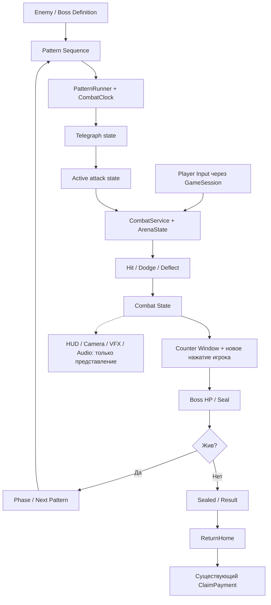

# ROKAS COMBAT 3.0 DESIGN STUDY

12 сентября 2026 · Design proposal для последующего утверждения · PC / Windows

**Рекомендация:** пять духовных дорожек в небольшой 2.5D-арене; уклонение и ограниченное отражение читаемых атак; ручной контрудар по открывшейся печати. Пространственное давление сменяется коротким наступательным действием игрока. Музыка поддерживает бой, а правила попаданий определяет игровой таймер.

Навыки: применены superpowers:brainstorming и verification-before-completion. Запрошенный rokas-development-workflow отсутствует в доступном каталоге и не найден среди локальных SKILL.md; его содержимое не предполагалось. Рабочие ограничения ROKAS взяты из действующего AGENTS.md и прямого запроса.

Это законченный проектный документ, а не утверждение о реализованной или протестированной Combat 3. Все новые числа ниже — стартовые параметры прототипа. Репозиторий, Combat 2, ветки и Unity-ассеты в этой работе не менялись.

## 1. Reference video analysis

Источник: [IMG_9344.MP4](D:/IMG_9344.MP4), 47,41 с, 1920×880; декодер сообщает среднюю частоту 26,71 кадра/с. Разобран видеоряд по всей временной шкале: 95 последовательных выборок с шагом 0,5 с, затем переход 26–28 с с шагом 0,125 с и отдельные полноразмерные кадры. Таймкоды приблизительные; это визуальный разбор последовательностей, не измерение каждого кадра. **Аудиодорожка присутствует, но не прослушана: BPM, попадание атак в музыкальные доли и характер SFX не подтверждены.**

| Время | Наблюдение | Значение для дизайна |
| --- | --- | --- |
| 00:00–00:04 | Почти чёрное поле; игрок внизу, маленькая фигура противника выше центра. Краткий белый акцент около противника примерно на 00:03 | Вступление задаёт иерархию внимания до потока угроз |
| 00:04–00:10 | Светящиеся дуги разных цветов идут из глубины к нижней зоне. Игрок меняет горизонтальную позицию; есть кадры с поднятой позой и шлейфом | Повторяемая форма и направление позволяют читать приближение |
| 00:10–00:18 | К дугам добавляются высокие светящиеся столбы; наверху постепенно множатся фигуры | Усложнение через новый силуэт угрозы и комбинации |
| 00:18,5–00:23 | Появляется небольшая HP-полоска возле игрока; продолжаются дуги и столбы, позиционные перестроения | Видна локальная обратная связь состояния здоровья. Точный момент/размер урона не устанавливается этой выборкой |
| 00:24–00:26,4 | Меняется цветовой набор: жёлтые дуги и красные столбы | Палитра участвует в смене зрительного мотива; семантика цветов из ролика не доказана |
| Около 00:26,5 | Массовый фон исчезает, центральный противник увеличивается, становится видна перспективная сетка | Смена постановки при сохранении направления потока |
| 00:26,5–00:29,4 | На сетке читаются пять продольных коридоров; серии голубых столбов чередуются с дугами | Пространственная основа остаётся простой даже при плотной последовательности |
| 00:29,5–00:34,5 | Наверху появляются две фигуры с ракетками и перемещающийся между ними объект; около них вспышки | Новые «исполнители» дают характер сцене без полной замены арены |
| 00:35–00:37 | Остаётся одна фигура; к игроку движутся синие объекты другой формы | Короткая смена словаря атак |
| 00:37,5–00:40 | Разлетающиеся маленькие фигуры накладываются на знакомые атаки | Визуальное усиление поверх узнаваемых механик |
| 00:40,5–00:45,5 | Фон заполняется рядами фигур, меняет масштаб и цвет; угрозы продолжают идти по прежним коридорам | Напряжение растёт в том числе за счёт окружения |
| 00:46–00:47,4 | Кольцевой узор из фигур; запись обрывается | Это конец приложенного фрагмента, не доказанная победа или финальная фаза |

**Арена и управление.** Игрок расположен в нижней части, враги — в глубине, атаки визуально увеличиваются при приближении. Пять дорожек отчётливо видны после 26,5 с; в начале разметка скрыта. Ввод клавиш, реальные хитбоксы, правила прыжка/рывка/неуязвимости по записи не определяются.

**Темп.** Крупные мотивы сменяются примерно через 4–10 с, внутри них идут более короткие повторения. Например, серия столбов в 26–28 с проходит несколько стадий приближения меньше чем за секунду. Скорость в игровых единицах и точные reaction windows неизвестны.

**Telegraphing.** Наблюдаемое предупреждение — прежде всего видимый путь угрозы из глубины, её силуэт и расстояние. Нельзя приписывать ролику полноценную систему наземных предупреждений, если она в кадре не показана.

**Камера, эффектность, ограничения.** Нижняя зона игрока относительно стабильна; меняются масштаб противников, фон и состав сцены. По записи нельзя уверенно разделить движение камеры и масштабирование объектов. Высокий контраст помогает чтению, а насыщенный фон конца ролика конкурирует с угрозами.

**Что не показано:** полный бой от запуска до награды, правила нанесения урона боссу, его HP/фазовые пороги, экран смерти, retry, сохранение прогресса. Эти части ROKAS ниже проектируются отдельно.

## 2. What ROKAS should borrow

- Один устойчивый пространственный язык: противник в глубине, игрок ближе к камере, атака приближается к линии контакта.
- Узнаваемые семейства угроз, которые сначала показываются отдельно, затем комбинируются.
- Эскалацию через поведение и постановку: другой источник атак, новые сочетания, изменение окружения.
- Промежуток между обнаружением угрозы и столкновением как главный ресурс игрока.
- Ясное разделение сцены на фон, угрозы и персонажа; контроль визуального контраста.

Для ROKAS дорожки становятся каналами духовной энергии в мокром камне, а смена постановки — проявлением ёкая и повреждением его печати.

## 3. What ROKAS should NOT copy

Не переносить буквально персонажей, музыку, рисунки, атаки и психоделическую палитру. Не скрывать геометрию в обучении, не строить обязательную механику только на различении цветов и не закрывать игрока декоративными фигурами.

Не делать весь бой ожиданием окончания песни. Победа ROKAS требует осмысленного ручного наступления. Автоматический удар после выживания, возвращение старого autoattack UI и принудительное точное попадание в музыкальный beat исключены.

## 4. Combat concepts considered

| Критерий | A — пять дорожек + печать, рекомендуется | B — свободная горизонтальная зона | C — сетка 5×2 |
| --- | --- | --- | --- |
| Сильная сторона | Быстрое чтение, ясный выбор пути, выразительные контрудары | Плавное движение и точное позиционирование | Дополнительные маршруты, давление по глубине |
| Главный недостаток | Риск ощущения музыкальной дорожки; лечится окружением и наступлением | Требует постоянной оценки краёв хитбокса | Больше решений, менее ясная перспектива |
| Сложность | Средняя: переходы, таймер, проверка достижимости | Средняя/высокая: непрерывные траектории и баланс ширин | Высокая: соседство, глубина, камера и двойной словарь |
| Визуальный потенциал | Высокий при стабильной 2.5D-постановке | Высокий, но больше VFX вокруг хитбокса | Высокий, с риском визуальной путаницы |
| Масштабирование контента | Маски дорожек, зеркала и последовательности | Каждой форме нужна пространственная доводка | Комбинаторика растёт вместе с QA |
| Контроль | Дискретные команды, короткое плавное перемещение | Аналоговое удержание, свобода микрокоррекции | Управление минимум по двум осям |
| PC / gamepad | Удобно для клавиатуры и D-pad | Хорошо для стика; клавиатуре нужна аккуратная скорость | Удобнее gamepad, обучение дольше |
| Mobile, только оценка | Возможна последующая адаптация | Палец/стик может закрывать угрозы | Наиболее сложная адаптация |
| Производительность | Дешёвая логика, стоимость в основном в эффектах | Логика немного сложнее, VFX всё равно доминирует | Проверок/объектов больше, но главный риск — дизайн |
| Стоимость контента | Наименьшая из трёх при общих примитивах | Больше ручной проверки каждого паттерна | Наибольшая матрица анимаций и тестирования |

**Выбор A:** пять дорожек и собственная механика печати/контрудара. Свободную горизонталь и второй ряд не добавлять в первый slice. Mobile не входит в текущую разработку.

## 5. Recommended Combat 3

Рабочее название концепции: **«Пять путей — разрыв печати»**.

Охотник защищается от короткой последовательности атак ёкая. По её завершении противник открывается на 1,1 с. Игрок нажимает атаку и выполняет направленный удар духовным клинком; пропуск окна означает отсутствие урона, после чего бой продолжается.

Контрудары, точные уклонения и отражения ослабляют **Seal**, а мастерство накапливает **Resonance**. Разрыв печати усиливает следующий вручную выполненный контрудар. Всё происходит в существующем цикле контракта ROKAS.

Обычный бой: ориентир 30–60 с; элита 60–90 с; первый босс 2–3 минуты у освоившего управление игрока. Это цели для playtest, не жёсткие таймеры или основание растягивать HP.

**Рендеринг:** компактная 3D-арена с фиксированной перспективной камерой, стилизованные 3D-охотник и главный босс, иллюстрированный дальний фон и 2D/mesh VFX. Игровая механика остаётся 2.5D. Полный свободный 3D и дополнительные ракурсы каждого врага не требуются.

3D-окружение с 2D-персонажами дешевле при наличии готовых спрайтов, но потребует направленных анимаций и осторожного света. Billboards годятся для далёких духов. Ортографика упрощает чтение, но слабее подчёркивает приближение. Поэтому основной выбор — умеренная перспектива с неизменным gameplay framing, а не переключение проекции во время атаки.

## 6. Player controls

| Действие | PC | Gamepad |
| --- | --- | --- |
| Один путь влево/вправо | A/D или стрелки | D-pad или горизонталь стика с порогом |
| Уклонение | RMB | B / восточная кнопка |
| Отражение | Space | LB |
| Контрудар в открытом окне | LMB | X / западная кнопка |
| Подготовить Resonance | R | Y / северная кнопка |
| Пауза | Esc | Menu |

Это два направления и четыре боевых действия. Новые способности, прыжок отдельной кнопкой, обычный блок, комбо из трёх кликов и рисование ритуала **для режима C3** в первый slice не включаются. Combat 2 сохраняет своё управление.

Один нажим движения выбирает соседнюю дорожку; стартовое время перехода 0,12 с. Удержание повторяет переходы через 0,18 с. Одновременные A+D дают нейтральное направление. Очередь — максимум одно намерение движения; удержание после паузы требует нового ввода.

RMB с направлением перемещает на соседнюю дорожку, без направления выполняет уклонение на месте. На краю запрещено выходить за арену; команда наружу становится уклонением на месте. Отражение и рывок имеют общий cooldown 0,55 с.

LMB обрабатывается как одно новое нажатие в Counter Window; клик раньше окна не копится. Нельзя удержать кнопку заранее и получить автоудар. Для контроллера и клавиатуры правила одинаковы. Все клавиши допускают переназначение.

## 7. Core combat loop

1. Существующий контракт → портал → выбор определения боя C3.
2. Intro до 3 с; игрок видит своё положение, дорожки, врага.
3. Ready 0,8 с, затем предупреждение первой угрозы.
4. Pattern 6–10 с: перемещение, уклонения, необязательные отражения.
5. После последнего разрешённого столкновения опасности убраны; Recovery 0,25 с.
6. Counter Window 1,1 с: печать раскрыта, LMB доступна из любой дорожки.
7. Успех: один удар, уменьшение HP/Seal, короткая реакция; пропуск: печать закрывается без урона.
8. Проверка смерти → порога фазы → следующего паттерна, в таком порядке.
9. На фазовом пороге — безопасный переход, затем новый предупреждённый паттерн.
10. Последний ручной удар → Sealed → визуальный finisher → Home → существующая Payment → ClaimPayment ровно один раз.

Counter Window доступно и после получения урона: ошибка уже стоила HP и не должна лишать игрока возможности закончить бой. Точное выполнение повышает эффективность, но не является обязательным условием победы.

Смерть игрока отменяет паттерн/ввод и ведёт в существующий Failed flow. В полном slice — короткий экран результата и возвращение Home; быстрое повторение контракта использует действующие правила создания run identity. Бесплатный отдельный retry внутри босса — только режим тренировки без награды и прогрессии.

## 8. Player offense/defense

**Движение.** Нормальный переход не даёт неуязвимости. Авторитетная горизонтальная позиция перемещается непрерывно; визуальная модель следует ей. Столкновения учитывают пройденный между тиками путь, чтобы перескок не позволял проходить сквозь опасность.

**Уклонение.** Стартовые i-frames 0,18 с. Они защищают от низких волн/дуг и обычных снарядов. Столбы, длительные разломы и обозначенные тяжёлые зоны требуют выхода на безопасную дорожку. Эти классы различаются формой: «можно уклониться» — низкая дуга; «нужно уйти» — сплошной вертикальный силуэт и перечёркнутый знак рывка.

**Perfect dodge.** Награда только при реально предотвращённом пересечении с атакой в первые 0,08 с уклонения. Пустой рывок не даёт ресурс. Одна атака выдаёт бонус максимум один раз; один dodge начисляет Perfect-бонус максимум за одну угрозу, даже при нескольких одновременных пересечениях.

**Deflect.** Окно 0,14 с от нажатия, работает только против явно обозначенного отражаемого снаряда. Отражение расходует исходный attack instance, даёт Seal damage и короткий обратный визуальный след. В первом slice возвращённый след не имеет собственной физики и не создаёт второй авторитетный удар. У каждого такого снаряда на Normal есть путь обычного избегания.

**Урон и восстановление.** После повреждения — 0,65 с защиты от повторного HP-урона, короткая реакция 0,12 с, затем снова доступно движение. Один объём угрозы не наносит урон каждый кадр. Длительное стояние в зоне после окончания защиты может причинить следующий отдельно определённый tick урона. Не делать цепочки stun-lock.

**Контрудар.** Базовый урон использует существующие contract damage и weapon multiplier; стартовый коэффициент C3 — 1,8. Урон наносится один раз при принятии команды; анимация показывает событие, но не решает его повторно. Попадание по открытой печати не требует точного курсора и не зависит от выбранной дорожки.

**Seal и Resonance — конкретные стартовые правила:**

| Событие | Seal противника | Resonance игрока |
| --- | --- | --- |
| Ручной обычный counter | −25 | +10 |
| Deflect обозначенного снаряда | −12 | +12 |
| Perfect dodge реальной угрозы | −8 | +8 |
| Обычное перемещение/выживание | Без изменений | Без изменений |
| Получение урона | Без изменений | −10, минимум 0 |

Seal начинается со 100. При нуле сохраняется один токен SealBreak. Он усиливает **следующий** counter на 60%, после чего Seal возвращается к 100. Если counter сам обнулил Seal, усиление применяется к следующему окну, без повторного урона в текущем. Пока токен ожидает, дополнительное снижение Seal не накапливается.

Resonance ограничен 100. R при полном ресурсе резервирует усиление следующего counter на 50%. Ресурс списывается только при успешном counter; повторные R ничего не складывают. Повреждение снимает резерв и уменьшает ресурс; пауза/focus loss снимают резерв без расхода. SealBreak и Resonance складывают бонусы: максимум 2,1× базового counter, не перемножаются.

Отдельного Ultimate, пассивного урона, неограниченной зарядки и шкалы stamina в MVP нет. «Особый приём» — тот же усиленный контрудар с более сильной подачей. Переносить текущий Combat 2 Resonance-duration и drag-ritual в C3 без изменения дизайна нельзя: это разные правила encounter mode.

## 9. Arena / lane design

Пять равноудалённых дорожек с индексами 0–4, старт в центре 2. У игрока одна линия глубины; перспективная координата летящего объекта означает время до контакта, а не возможность ходить к боссу.

Первый вариант окружения — мокрый двор небольшого святилища: швы камня и слабые духовные потоки образуют дорожки. До боя разметка почти естественная; в бою активные каналы слегка проявляются. Ступни и контактная тень всегда видны.

Условная логическая ширина дорожки — 1. Стартовая полуширина хитбокса игрока — 0,22; узкого снаряда — 0,22. Спрайт/модель может быть шире хитбокса, но визуальное ядро угрозы должно соответствовать зоне попадания. Точные размеры выбираются после теста движения, а не из размеров декоративного mesh.

Базовый горизонт предупреждения — 1,0–1,4 с; обучение 1,5 с. Минимум Normal 0,8 с для новой самостоятельно читаемой угрозы. Смена безопасной дорожки заранее показывается и не требует движения быстрее механически возможного.

Проверять комбинацию целиком: наличие свободной дорожки в каждом отдельном кадре не доказывает существование пути между ними. Для поздних паттернов учитываются положение, время перехода, i-frames, общий defense cooldown и безопасная landing zone.

## 10. Boss architecture

Один data-driven исполнитель для обычных врагов и боссов. Босс — набор фаз и постановочных событий, без уникальной копии CombatService.

Фаза содержит ID, условия входа/выхода, разрешённые последовательности, первый обучающий показ нового мотива, cooldown повторения, difficulty profile и intensity presentation. Случайный выбор ограничен правилами: без повторения одного тяжёлого мотива подряд, без несовместимых накладок, с воспроизводимым seed.

| Архетип | Чем отличается поведение |
| --- | --- |
| Fast yokai | Короткие чередования двух-трёх дорожек, частые маленькие окна ответа |
| Heavy yokai | Длинный замах, широкая тяжёлая зона, более долгое окно counter |
| Ranged spirit | Цепочки узких снарядов; отдельные выгодные deflect |
| Trickster | Видимые предвестники меняют цель до фиксированного момента; поздней подмены нет |
| Duelist | Последовательность «коротко — задержка — удар», один акцентированный ответ |
| Elite | Два освоенных мотива в комбинации, заранее обозначенный переход |
| Boss | Несколько фаз, собственная постановка и сигнатурная комбинация |

HP-пороги применяются после текущего разрешения и отмены опасностей, а не посередине скрытого таймера. Смерть имеет приоритет над переходом. Большой удар может перескочить порог: определить конечную фазу один раз, не проигрывать очередь из нескольких переходов.

Градация: tutorial — один силуэт и одна реакция; early — два мотива; elite — сочетания; miniboss — две фазы; boss — три; late boss — вариации знакомых правил. Новую форму сначала показать с мягким наказанием. Уменьшение окон ограничить нижними границами; основное усложнение — сочетания и смена решения.

## 11. Pattern system

Будущие ScriptableObject-определения преобразуются в простые runtime data при входе в бой. Core не должен читать Unity Assets или зависеть от Animator.

**PatternDefinition:** stable ID, версия, длительность, события, рекомендованные параметры сложности, требуемые действия игрока, окно ответа и лимиты одновременных угроз.

**AttackEvent:** уникальный ID в экземпляре паттерна; telegraph start; момент фиксации цели; active/contact time; end time; lane mask или траектория; тип угрозы; hit profile; допустимость dodge/deflect; presentation cue.

**ProjectileDefinition:** визуальное ядро и оболочка, путь/время приближения, хитбокс, lifetime, правила исчезновения. Скорость картинки выводится из той же временной шкалы, которая решает столкновение.

**SequenceDefinition:** фиксированный порядок или ограниченный выбор паттернов. Зеркало и смена дорожки — данные, не новый класс. Difficulty modifiers меняют только допустимые диапазоны, сохраняя минимальное предупреждение и достижимость.

**Авторитет:** один CombatClock и один путь разрешения урона. Предлагаемый fixed step — 1/60 с с timestamped input. Presentation интерполирует положение. Проверяется swept collision; при равном времени сначала принимается ввод, затем разрешается контакт. Это правило едино для replay и runtime.

Каждое событие проходит Telegraph → Active → Resolved → Cleanup один раз. Hit, dodge, deflect и counter имеют идентификаторы для защиты от дубликатов. Particle collision, звук и Animation Event не меняют HP.

Пауза, focus loss и teardown останавливают gameplay clock и очищают команды. Resume даёт 0,6 с на чтение без движения угроз, затем продолжает с сохранённого боевого времени; ввод защиты разрешается при возобновлении. При большом зависании, требующем догнать более 0,1 с симуляции за кадр, включается тот же suspend/resume путь вместо мгновенного проигрывания пачки ударов.

**Авторинг:** сперва список событий и простой preview/валидация в Inspector. Полноценный графовый редактор и интеграция с Unity Timeline — позже, только если фактическая стоимость авторинга оправдает их.

## 12. Example attack patterns

Обозначения: дорожки 0–4 слева направо; времена — предлагаемые для Normal. Все 12 определений входят в целевой slice, в том числе как безопасные комбинации базовых примитивов.

| # / паттерн | Telegraph | Атака | Безопасный ответ | Сложность |
| --- | --- | --- | --- | --- |
| 1. Один разлом | Трещина на 2 за 1,3 с | Тяжёлый столб на 2, 0,25 с | Перейти на соседнюю дорожку | Tutorial |
| 2. Двойной удар | Два прямых контура на 1 и 3 | Одновременные столбы | 0, 2 или 4 | Early |
| 3. Левый/правый | Три отдельных отметки за 1,1 с до каждой | 0+1, затем 3+4, затем 0+1, интервал 0,9 с | Последовательно менять сторону через центр | Early |
| 4. Низкая волна | Низкая дуга на всю ширину, 1,3 с | Один dodgeable фронт | Уклониться на линии контакта | Early, после обучения dodge |
| 5. Духовная нить | Ромб и двойное кольцо на 2, 1,2 с | Один отражаемый снаряд | Уйти с 2 или Space для бонуса | Early |
| 6. Движущееся окно | Светлая щель и стрелка следующего сдвига | Тяжёлые зоны оставляют 1→2→3, шаг 0,75 с | Следовать соседним безопасным дорожкам | Elite |
| 7. Чернильный след | Круг в занятой дорожке, цель фиксируется за 0,9 с | Задержанный взрыв и остаток 0,8 с | Уйти после фиксации, не возвращаться рано | Early/Elite |
| 8. Пересечение | Две диагонали в глубине, 1,2 с | Волны идут с краёв к центру с разнесённым контактом | Дождаться прохода первой, перейти в освобождённую область | Elite |
| 9. Спираль фонарей | Последовательно подсвечены 0→1→2→3→4 | Узкие снаряды с шагом 0,55 с | Следовать за прошедшим фронтом | Elite |
| 10. Обман тени | Пунктирная цель дрожит, затем сплошной контур | Один выбор цели меняется до фиксации; после неё 1,0 с | Реагировать на сплошной знак; прежний контур явно гаснет | Boss |
| 11. Взмах ворот | Большой замах и тяжёлый контур, остаётся край | Sweep 0–3 или 1–4 | Занять объявленный безопасный край | Boss |
| 12. Три удара колокола | Три визуальных импульса и заранее видимые траектории | Две низкие волны с интервалом 0,75 с, затем столб на фиксированной дорожке | Два dodge с доступным cooldown, затем шаг | Boss |

«Cross» и «spiral» описывают рисунок во времени в пяти коридорах, а не вводят новую 2D-физику. Fakeout не означает лживый финальный telegraph. Для прототипа валидатор должен проверять конкретные параметры таблицы, включая входную позицию после предыдущего паттерна.

## 13. Full example boss encounter

**Ёкай: «Хранитель пустых фонарей»**, рабочий оригинальный образ, не утверждённый канон. Высокая фигура в промокшей ритуальной одежде; перед грудью бумажная печать, за спиной погасшие фонари.

**Арена:** двор святилища ночью. Пять полос камня ведут к воротам. Дождь на дальнем плане; в зоне ног он ослаблен для чтения угроз.

| Этап | Хореография и действия игрока |
| --- | --- |
| Intro, до 3 с | Из фонарей уходит свет. Хранитель поднимает ладонь, проявляются швы дорожек. Камера возвращается в gameplay framing до Ready |
| Phase 1, 100–70% HP | Один разлом → духовная нить → двойной удар. Каждый мотив 6–7 с, counter 1,1 с после него. Новый столб сначала приходит один; deflect выгоден, но необязателен |
| Первый counter | После последнего столба печать раскрывается; LMB отправляет дугу клинка к груди. Ткань и фонари реагируют; игрок остаётся на своей дорожке |
| Transition, до 1,5 с | Остаточные угрозы исчезают, один фонарь трескается. Появляется след чернил — подсказка новой механики. В переходе урон невозможен |
| Phase 2, 70–35% HP | Чернильный след → движущееся окно → левый/правый. Новая механика: оставленная зона ограничивает возвращение. Первый показ отдельно, затем комбинация |
| SealBreak | При обнулении печати её нити расходятся. Следующий ручной counter пробивает её с усилением. Никакого отдельного drag-QTE |
| Transition, до 1,5 с | Ворота становятся силуэтом из тумана, за спиной босса выстраиваются духи. Контраст пола и угроз сохраняется |
| Phase 3, 35–10% HP | Пересечение → взмах ворот → три удара колокола. Интервалы слегка короче; одновременно не добавляется новый тип управления |
| Final, при ≤10% HP | Один раз за бой исполняется сигнатурная связка 12 длительностью 7–9 с. После неё обычное окно ответа, при выжившем боссе — освоенные паттерны без бесконечного повторения финального шоу |
| Finisher | Летальный ручной counter сразу переводит домен в Sealed и отменяет угрозы. Следующие 1,5–2 с — визуальное запечатывание; пропуск не повторяет результат |
| Victory | Короткое подтверждение, ReturnHome, сообщение результата и оплата через существующие системы |

Ориентир — 9–12 успешных окон counter без усилений; точные HP подбираются через текущую формулу оружия. Если улучшенное оружие убивает босса раньше Final, смерть имеет приоритет: не включать скрытую неуязвимость ради обязательной катсцены.

## 14. Camera

Во время угроз камера фиксирована: все пять дорожек, ступни и источник ближайшей атаки видны. Игрок занимает нижнюю центральную область, босс — верхнюю, HUD не перекрывает контактную линию.

Вступление может показать лицо/маску, но возвращается за 0,8 с до первой угрозы. Zoom и небольшая дуга вокруг босса разрешены только в безопасном переходе и finisher. Смена фазы не меняет воспринимаемую ширину дорожки в середине движения.

Стартовые feedback-параметры: 0,04 с hit-stop на сильном counter, максимум 0,07 с на разрыве печати; без hit-stop на каждом обычном уклонении. Он останавливает все боевые таймеры и траектории согласованно. Декоративная камера/фон могут получить короткое смещение до примерно 3–4 px при 1080p; предупреждение и контактная геометрия остаются неподвижны.

Настройки отдельно отключают shake, вспышки и сильный hit-stop. Смерть/победа позволяют спокойный отъезд камеры после отмены всех атак.

## 15. VFX

| Значение | Форма и поведение | Цветовая роль |
| --- | --- | --- |
| Безопасный путь | Чистый пол, спокойная граница щели, стрелка следующего положения | Нейтральный свет; не обязательный зелёный |
| Опасность | Сплошной контур, растущая заливка к моменту контакта | Красно-янтарный акцент |
| Dodgeable | Низкий дуговой фронт, сохраняющий силуэт | Общая палитра угроз |
| Deflectable | Ромб в ядре и сходящиеся двойные кольца | Светлое ядро; форма отличает его от обычного |
| Perfect timing | Короткое замыкание кольца у игрока | Бело-золотой акцент |
| Player counter | Один направленный разрез и след печати | Холодная духовная энергия |
| Boss special | Широкий уникальный знак, затем обычный читаемый active contour | Тёмные чернила плюс акцент угрозы |
| Damage | Короткая реакция тела, локальный flash и отметка у HP | Тёплый акцент без полноэкранного красного поля |
| Phase transition | Фонари, туман, дальние силуэты | Изменение интенсивности в безопасном интервале |

Cyan/синий не означает «безопасно», если это атакующая энергия. Значение всегда дублируется геометрией и поведением.

**Built-in Render Pipeline сохраняется.** Достаточны vertex-colored/unlit материалы предупреждений, transparent/additive mesh trails, ParticleSystem, UV scrolling, простое dissolve печати по noise mask и локальные вспышки. Светящийся ореол можно дать самим материалом/спрайтом; обязательного bloom/post-processing пакета нет.

Для окружения — обычный свет/запечённые элементы, туман существующего стиля, небольшие мокрые блики. Screen-space refraction, дорогие полноэкранные искажения, realtime planar reflections и миграция на URP в обязательный список не входят.

Попадание: короткий звук + реакция модели + один локальный эффект. Цифры урона по умолчанию скрыты, доступны в debug/настройках. Perfect dodge даёт компактный свет/звук, но не перекрывающий экран текст на каждой атаке.

## 16. 3D model roadmap

| Приоритет | Персонажи | Окружение и вспомогательные элементы |
| --- | --- | --- |
| MUST HAVE для slice | Один охотник с оружием; обычный ёкай и вариант элиты на совместимом rig; один босс | Один пол святилища, ворота, фонари, несколько крупных props; простые meshes угроз |
| SHOULD HAVE после подтверждения feel | Материал/детали элиты; уникальная маска босса; несколько вариантов оружия без новых movesets | Влажность, дальняя иллюстрация, вариации света и повреждённая версия props |
| LATER | Другие тела/rigs, дополнительные боссы, редкие костюмы | Улица, лес, интерьер/подземелье как повторно используемые arena kits |

Не требовать новую модель под каждый PatternDefinition. Emitters — точки привязки на rig, а telegraph meshes собираются из общих простых форм. Внешний вид игрока и босса утверждать в масштабе реальной камеры; крупный turnaround сам по себе не доказывает читаемость.

## 17. Animation roadmap

**Охотник: 10 основных клипов:** idle; шаг влево; шаг вправо; dodge; hit; deflect; counter; enhanced counter; death; victory. Perfect dodge использует обычный dodge с другим feedback. Отдельный jump и special moveset не нужны.

**Обычный враг/элита: 6–8 общих клипов:** idle, два windup, attack/release, hit, stagger, death; elite отличается таймингом/силуэтом и несколькими деталями.

**Босс: 8–10 клипов:** idle, два характерных telegraph, release, hit, stagger, phase transition, signature attack, death; intro может использовать idle/telegraph и постановку.

Retarget — базовые стойки/шаги совместимых гуманоидов. Procedural — лёгкий recoil, наклон, движение фонарей, небольшая реакция ткани. Reuse — hit, стандартное release и простой phase accent. Unique — сигнатурный замах босса, читаемый counter героя, важный finisher.

Игровое движение задаёт домен; root motion не смещает хитбокс. Время урона не привязывается к единственному Animation Event. Скорость анимации можно подстроить к утверждённому timing profile, не сжимая предупреждение.

Pipeline: concept в gameplay framing → модель → topology → UV → textures → rig → clips → Unity import с сохранением GUID → Animator presentation → синхронизация со state/events → проверка силуэта, ступней, weapon trail и переходов.

## 18. UI/HUD

Постоянно: небольшие Player HP снизу слева; Boss HP и имя сверху; тонкая Seal под Boss HP; Resonance снизу справа. Фаза обозначается делениями boss bar и короткой надписью при переходе.

Временно: подсказки действий в обучении; LMB/кнопка контроллера над раскрытой печатью; краткая отметка Perfect; заполнение cooldown рядом с обозначением защиты. Без ленты DPS, счётчика нот и отдельной постоянной полосы combo.

Угрозы читаются на арене, а не через цифры таймера. В конце паттерна внимание переносится на печать, поэтому counter prompt расположен возле босса. Контраст и размеры проверяются при 1280×720 и 1920×1080; для ultrawide сохраняется общая ширина арены, а не растягиваются дорожки.

Настройки: remapping, отдельные уровни Music/SFX, reduced motion/flash, повышенная видимость telegraph и более широкие окна Assist. Assist замедляет и визуал, и логические события согласованно.

## 19. Music/SFX

| Режим | Плюсы | Цена/риск |
| --- | --- | --- |
| Fully beat-synced | Очень плотная музыкальная хореография | Авторинг под каждый трек, сложнее пауза, tempo changes и доступность |
| Partially rhythm-aware — выбор | Музыкальные фразы поддерживают циклы; gameplay сохраняет самостоятельность | Нужны понятные точки начала фраз и безопасная синхронизация |
| Независимое музыкальное сопровождение | Самое дешёвое и устойчивое | Меньше ощущения музыкального диалога |

Pattern timings авторятся в секундах. Запуск фразы можно совместить с музыкальным акцентом в безопасном промежутке; уже объявленную угрозу не двигать ради beat. Музыкальные стемы или версии intensity следуют фазе. При mute музыки бой полностью читается и проходит по тем же правилам.

SFX нужны для появления предупреждения, тяжёлого/низкого удара, deflect, dodge, Perfect, counter, SealBreak, повреждения, phase transition, victory/death и UI. Локальная атмосфера — дождь, ветер, далёкий колокол. Приоритет слышимости: опасность → повреждение/deflect → counter → музыка → ambience.

Одновременно ограничивать близкие однотипные звуки, использовать пул AudioSource и один значимый акцент на событие. Музыка и UI не должны перезапускаться при каждом объекте.

**Voice acting: DEFERRED / OUT OF SCOPE.** Обязательная озвучка персонажей не входит ни в MVP, ни в slice.

## 20. Unity architecture

**Фактически найдено:** CombatService владеет Combat 2 rules, HP/Seal/Resonance и Hit/ActionResolved; GameSession перенаправляет ввод, тикает Combat и LiveMessages, возвращает Home и проводит ClaimPayment; MissionView, CombatHud и CombatInputSurface отвечают за существующее представление/жесты.

Основные подтверждённые точки: [CombatService.cs](D:/Rokas/Rokas/Assets/Rokas/Scripts/Core/CombatService.cs), [GameSession.cs](D:/Rokas/Rokas/Assets/Rokas/Scripts/Core/GameSession.cs), [MissionView.cs](D:/Rokas/Rokas/Assets/Rokas/Scripts/Presentation/MissionView.cs), [CombatInputSurface.cs](D:/Rokas/Rokas/Assets/Rokas/Scripts/Presentation/CombatInputSurface.cs). Manifest содержит uGUI; URP в зависимостях отсутствует. Built-in задан исходным брифом, editor rendering в этой работе не запускался.

**Рекомендуемая эволюция:** сохранить один GameSession/CombatService façade и один result/payment lifecycle. Добавить pattern encounter как композицию правил внутри существующей границы Combat, выбранную определением встречи. Старый timing-driver C2 и новый pattern-driver C3 взаимоисключаются; они никогда одновременно не тикают одного врага.

| Узел | Будущая ответственность | Переиспользование / граница |
| --- | --- | --- |
| CombatService | Авторитетные HP, защита, Seal, Resonance, завершение встречи | Существующий владелец; не дублировать |
| GameSession | Команды, общий tick, Changed, run/contract orchestration | Сохраняет LiveMessages и существующие действия Home |
| PatternRunner | Расписание, IDs атак, временные состояния, отмена | Новый небольшой Core-модуль без Unity |
| ArenaState / LaneMotion | Позиция, переход, bounds, геометрия контакта | Новая часть Core, не MonoBehaviour-физика как источник истины |
| Pattern/Enemy/Boss definitions | Сериализованный контент; проверка и преобразование в runtime data | Unity ScriptableObjects + plain Core values |
| Phase runner | Выбор фазы/следующей последовательности | Композиция encounter-driver, не отдельный God BossController |
| Combat input routing | A/D, Dodge, Deflect, Counter, Resonance; cancellation и блокировки UI | Расширение текущего presentation input/lifecycle |
| Arena / projectile views | Существующие положения и события превращает в meshes/модели | Pool/release без нанесения урона |
| MissionView / CombatHud | Выбор presentation режима, актуальные HP/Seal/подсказки | Существующий shell/uGUI; UI не хранит боевую истину |
| Camera/VFX/Audio presentation | Читает события, соблюдает budgets и reduced motion | Переиспользовать RokasAudio/WorldEffects где совместимо |
| Result handling | Sealed/Failed → ReturnHome → Payment | Существующие Contract/Economy/GameSession; нового reward manager нет |

Названия новых узлов — роли дизайна, не требование создать по классу/файлу на каждую строку. Выделять интерфейс только там, где есть реальная смена реализации или полезная тестовая граница. Не заводить второй bootstrap, global event bus, DI framework или новый проект.

**Важная граница переиспользования:** текущие Dodge/Deflect проверяют один state.enemyTimer и вызывают ScheduleAttack. Эти методы нельзя без изменений вызывать для каждого снаряда C3: отражение одного объекта не должно отменять всю последовательность. C3 разрешает защиту по attack instance ID внутри того же владельца Combat. Аналогично текущий SealBreak ведёт в drag-ritual C2; для C3 используется отдельное правило токена усиления, не изменяющее C2 stage flow.

**Сохранения.** В первом C3 slice середина паттерна не сериализуется. Для C3 при reload встреча начинается заново с определённого стартового состояния; UI заранее сообщает это. run identity/контракт остаются существующими, награда не создаётся. Для C2 текущее восстановление HP/таймеров сохраняется. Нужен явный стабильный способ распознать C3 encounter через данные контракта; любые новые save fields вводить совместимо и с миграционными тестами. Нельзя молча трактовать C2-save как C3 или перезаписывать более новую неизвестную схему.

**Ресурсы.** Любое завершение/смена режима отменяет clock ownership, input, подписки, снаряды, VFX и зарезервированные действия. Home не управляет объектами паттерна.

**Будущая проверка:**
- Core: детерминированный replay при разных частотах render; swept contact, границы интервалов защиты, отсутствие Perfect без угрозы, один effect/event, cooldown, SealBreak и R без дубликатов, phase/death priority.
- EditMode: валидность определений, IDs, ссылки, времена, достижимые ответы, текущие save/backup и миграции.
- PlayMode: реальный ввод через действующий UI, пауза/focus/teardown, viewport/предупреждения, отсутствие атак из меню, повторные входы, возврат ресурсов.
- Интеграция: Home, Weather, Laptop, Messages/Live Messenger, Combat 2 и C3, сохранения, defeat/victory, duplicate result/ClaimPayment, reload до/после оплаты.

**Производительность — бюджеты для измерения, не обещанные результаты:** Windows 1080p/60 на зафиксированном QA-PC; p95 frame time ≤16,7 мс, p99 ≤25 мс после прогрева. В прототипе потолок 200 логических угроз и 64 видимых attack views, отдельно ограниченная декоративная масса. Пул threats/VFX/audio; отсутствие GC allocations у steady-state Core tick; без Instantiate/Destroy на каждый снаряд; lifetime и reset всех pooled objects обязательны. Draw calls, прозрачный overdraw, particles и Animator cost измерять в реальном worst-case кадре. При перегрузке сокращать декор, сохраняя все обязательные telegraphs. ECS, GPU simulation и custom renderer заранее не нужны.

## 21. Content pipeline

Оценка объёма, не производственная смета. «Полная игра» здесь — **условный масштаб 20 обычных/элитных enemy definitions + 10 bosses + 100–120 pattern definitions**, а не утверждённое число контента ROKAS.

| Контент | Проверочный MVP | Первый polished slice | Условный полный масштаб |
| --- | --- | --- | --- |
| Персонажи | 1 hunter proxy + 1 enemy proxy | 1 hunter + normal/elite variants + 1 boss: 3–4 модели | 1 hunter, около 6 общих тел для 20 enemies, 10 boss bodies; примерно 17 базовых моделей |
| Арены | 1 серый пол | 1 законченный shrine kit | Около 5 kits с вариантами |
| Боссы | 1 proxy с одной фазой | 1 законченный трёхфазный | 10 |
| Анимации | 6–8 placeholder/reused | 24–32 clips, часть общая | Примерно 160–220 clips при повторном использовании rigs |
| Паттерны | 4 простых | 12 | 100–120 definitions, из них 20–30 базовых мотивов |
| VFX | 5–6 общих эффектов | 10–14 | 25–40 семейств с вариациями |
| UI | 1 wireframe HUD, 4–6 знаков | 1 HUD, 8–12 знаков/состояний | Общий HUD, около 20–30 знаков/вариантов |
| SFX | 10–14 | 24–36 | Около 80–120 плюс вариации |
| Music | 1 временный лицензированный/собственный loop | 1 track или 2–3 слоя intensity | Ориентир 8–12 themes с общими слоями |
| Материалы | 3–4 простых | 6–8 reusable materials | 10–15 семейств, варианты поверх них |

Паттерн проходит: замысел → timeline событий → логическая валидация → proxy playtest → telegraphs → animation/VFX → повторная проверка читаемости → фиксация версии. Перекраска не считается новым паттерном для оценки разнообразия.

Перед заказом 3D: проверить силуэт и тайминг дешёвыми формами. Перед новым enemy rig: доказать, что существующий не поддерживает нужное поведение. Перед новым боссом: завершить encounter specification и список реально уникальных клипов. Стоимость обычно растёт быстрее от уникальных rigs/анимаций, чем от количества data definitions.

## 22. MVP vertical slice

**MVP проверки идеи:** пять дорожек, четыре мотива (1, 4, 5, 7), proxy-враг, movement/dodge/deflect/manual counter, HP, Seal, victory/death. Без нового художественного производства и без обещания готового игрового milestone.

**Первый законченный slice:** один hunter, одна арена, normal enemy, elite на общем rig, босс из §13, 12 паттернов, полный минимальный HUD, SFX/music, пауза/focus, обучение, сохранение на разрешённых границах, результат и существующая оплата.

Критерии fun/читаемости для целевого playtest из пяти новых игроков:
- Не менее четырёх без подсказки разработчика объясняют, когда нужно двигаться, dodge и counter.
- Не менее четырёх заканчивают обучение максимум за три попытки.
- После ошибки не менее 80% обсуждённых случаев участники связывают с конкретной угрозой/действием; скрытые попадания исправляются.
- Босс стабильно заканчивается примерно за 2–3 минуты у освоившего управление игрока, без обязательного Perfect.
- Не менее четырёх хотят повторить бой; это небольшая качественная проверка, не статистическое доказательство.
- Музыка mute и reduced effects сохраняют играбельность.
- Интегрированная проверка подтверждает контракт → бой → Home → одну оплату.

Если не работает movement/ответ, художественные фазы не расширяются. Итог MVP может потребовать изменения параметров, но не автоматически нового framework.

## 23. Phased implementation roadmap

Эти фазы описывают будущую работу. Сейчас ни одна не реализуется.

**Общий milestone gate:** любая выдача пользователю на ручную QA сначала интегрируется в integration/rokas-unified и проходит полный установленный набор проверок. Внутренняя изоляция не означает отдельную пользовательскую папку. C3 до продуктового утверждения остаётся выключенной по умолчанию/доступной через явный review route; Combat 2 продолжает работать. Phase 10 ниже — продвижение готовой системы, а не первая техническая интеграция.

| Фаза / цель | Deliverables | Зависимости | Будущие тесты | Visual proof | Definition of done |
| --- | --- | --- | --- | --- | --- |
| 0 — проверить боевое решение | Proxy-арена, пять путей, четыре мотива и ручной ответ; краткий feel report | Утверждение дизайна и конкретного milestone; восстановленный verified baseline | Минимальные Core timing/input/one-counter cases по TDD | Запись dodge → counter → damage без монтажа | Понятно и управляемо; scope не расширен; перед user QA общий gate |
| 1 — movement + lanes | Authoritative motion, bounds, input repeat, dodge/cancel | 0 | Sweep, край, одновременные направления, cooldown, pause/focus | Игрок проходит все дорожки и демонстрирует край/возобновление | Модель, hitbox и управление согласованы |
| 2 — pattern system | Definitions, runner, IDs, preview и validator | 1 | Replay, event order, reachability, отмена и большие delta | Четыре мотива при разных частотах кадров | Паттерн создаётся данными, телеграф и hit совпадают |
| 3 — damage/counter | HP/Seal/Resonance, ручное окно, defeat/victory | 2 и существующий result lifecycle | Spam, early click, SealBreak/R, двойные callbacks, lethal | Обычный/усиленный counter и пропущенное окно | Idle не повреждает врага, каждый результат разрешается один раз |
| 4 — enemy/boss | Normal/elite/boss definitions и все 12 паттернов | 3 | HP thresholds, skip thresholds, death priority, illegal combos | Все фазы proxy-босса, один обычный враг/элита | Различия получаются данными, новые core if/else не нужны |
| 5 — camera/VFX | Общий визуальный словарь и bounded feedback | 4 | Hit-stop clock consistency, reduced effects, lifetime | Сравнение normal/reduced и самый плотный паттерн | Угрозы/ступни читаются, эффекты не меняют попадания |
| 6 — 3D/animations | Только assets slice из §16–17 | Успешный feel gate 0–5 | Import/GUID, отсутствующие ссылки, root-motion isolation | Реальная runtime камера с final hero/boss и силуэтами | Нет proxy в обещанной финальной части, контент в бюджете |
| 7 — HUD/audio | uGUI HUD, remap/hints, SFX priorities, music intensity | 3–6 | UI blocking, mute/pause/resume, input device change | 720p/1080p, keyboard/gamepad, звук включён/выключен | Бой понятен без музыки, UI отражает домен |
| 8 — vertical slice | Обучение, normal, elite, полный босс, контрактный маршрут | 1–7 | Сквозной бой/return/payment/reload плюс регрессии игры | Непрерывная запись Home → encounter → Home → payment | Критерии §22 и общий integrated gate |
| 9 — polish/testing | Balance pass, accessibility, profiler evidence, исправления выявленных дефектов | 8 и playtest feedback | Полные Core/EditMode/PlayMode, повторные входы, worst-case perf | Реальные failure/recovery и плотная фаза | Нет открытых blocker/major defects; baseline validator сравнён по составу |
| 10 — продвижение в ROKAS | Утверждённый выбор C3 для конкретных контрактов, save compatibility, rollout record | 9 и явное продуктовое одобрение | Весь integrated набор, C2 fallback, новый/старый save, exactly-once | Канонический маршрут в D:/Rokas/Rokas | Verified checkpoint, разрешённый push, точный local/remote SHA; Combat 2 удаляется лишь отдельным последующим решением |

Для каждого пользовательского milestone общий gate дополнительно включает текущие Home/Weather, Messages/Live Messenger, Laptop, Combat, save/progression и payment regressions; asset validator с сравнением конкретного набора findings, Unity log review, literal git diff --check с exit 0 и пустым выводом. Исторические 13 findings не являются разрешением на любые 13 новых ошибок.

После зелёного дерева — VERIFIED ROKAS UNIFIED INTEGRATION CHECKPOINT, push только integration/rokas-unified, проверка точного SHA. Каноническая папка обновляется лишь после проверки status, staged/unstaged diff, untracked collisions и editor state с сохранением пользовательских файлов. development, PR #4 и verified feature history защищены.

## 24. Risks

| Риск | Мера и сигнал остановки расширения |
| --- | --- |
| Бой скучен: только ждать | Pattern 6–10 с, ручной counter с заметной реакцией; ранний playtest до моделей |
| Повторение безопасной дорожки решает всё | Последовательности меняют положение и оставляют след; проверять реальный путь, не добавлять случайную неизбежность |
| Нечитаемые эффекты | Обязательные силуэты, постоянная линия контакта, less-effects/mute тест; снижать декор раньше угроз |
| Нечестные fakeouts | Пунктир до фиксации, сплошной telegraph после неё; после фиксации цель не меняется |
| Слишком много уникальных моделей | Общие rigs, elite variants, один boss slice до масштабирования |
| Слишком много анимаций | State-driven presentation, повторное использование; уникальные клипы только для читаемых важных действий |
| Камера мешает | Fixed gameplay framing; cinematic motion только в безопасных состояниях |
| Музыка диктует физику | Seconds-based clock; никаких сдвигов active events ради beat |
| FPS/GC/overdraw | Пулы, лимиты, profiler worst-case; сначала упрощать transparent decor |
| Difficulty spikes | Введение мотива отдельно; нижние границы предупреждения; reachability с cooldown |
| Дублирование архитектуры | Один façade/HP owner/result pipeline; новые узлы только для нового поведения |
| Двойная награда/сообщения | Существующий run identity и идемпотентный ClaimPayment; тест повторных callbacks и reload |
| Старые сохранения меняют смысл | Явное различение encounter definitions, additive migration, неизвестную схему не перезаписывать |
| Scope разрастается | До feel gate нет новых rigs, mobile, voice, URP, редактора графов, десятков врагов |

## 25. Migration from Combat 2

1. Сохранить текущее Combat 2 поведение и regression coverage.
2. Добавить C3 как выбираемый pattern encounter в существующей combat boundary; общие HP, контракт, экономика, lifecycle и presentation shell переиспользуются.
3. Внутренне собрать slice с feature gate. Изолировать правила C3 и определения, а не создавать новую копию игры.
4. Перед пользовательской QA интегрировать этот checkpoint в текущую единую игру и проверить всё вместе. Ручная QA — только D:/Rokas/Rokas.
5. Получить пользовательское одобрение нового feel и дизайна. До него C3 не заменяет обычный маршрут Combat 2.
6. После одобрения включать C3 для явно выбранных контрактов. Проверить старые saves, маршруты возврата и оплату.
7. Удаление/retirement C2 — отдельная задача после стабильной эксплуатации и одобрения. Ни одного destructive rewrite заранее.

Фактическое состояние при подготовке: checkout — feature/media-clean, HEAD ac502632549f6399a4445d3001e6006d14feeee0; локальная tracking-ссылка origin/integration/rokas-unified — 09994586c3004473706e15a900ebd54ad67c1f2e. Это локально наблюдаемые refs, **не новая проверка сервера и не назначение источника будущей реализации**. Есть изменения RamenNight.mp4.meta и untracked Unity/project files; они сохранены. Перед будущей реализацией необходимо восстановить тогда актуальный явно verified checkpoint и не включать неизвестное media work автоматически.

Исторические инструкции README о development/autoattack и отдельной QA-папке в Combat2Foundation не определяют будущий маршрут: действующий AGENTS.md имеет приоритет.

## 26. Visual references / diagrams

Референс 1 — 00:05,5: читаемое приближение простых дуг на контрастном поле.


Референс 2 — 00:19: рост фоновой массы, сочетания силуэтов, локальный HP.


Референс 3 — 00:27,5: пять дорожек, противник в глубине, последовательность столбов.


Референс 4 — 00:43,5: насыщенная эскалация фона; пример риска конкуренции с gameplay.


Схема 5 — предлагаемые arena/HUD/telegraph ROKAS, вид со стороны камеры:

```text
              ХРАНИТЕЛЬ         HP [────────────]
                                  Seal [──────]
                  [ печать / LMB при открытии ]

              0     1     2     3     4
              │     │     │     │     │
              │     !     │     !     │  ← предупреждение:
              │     ▓     │     ▓     │    столбы на 1 и 3
              │     ↓     │     ↓     │
              └─────┴─────●─────┴─────┘  ← линия контакта
                         игрок на 2

        HP [─────]                     Resonance [─────]
```

Знак ! и заполняемая геометрия означают опасность; чистая дорожка 2 — конкретный доступный ответ. В игре это швы мокрого камня и контур духовного разлома.

Схема 6 — поток данных; стрелки показывают зависимости, а не независимые источники урона:



## 27. Recommended final direction

**Принять для первого прототипа:** пять дорожек; умеренная перспектива; одна 2.5D-плоскость действий; четыре боевые команды; авторские предупреждённые паттерны; ручной counter; SealBreak и Resonance как усиление этого counter; один существующий combat/result lifecycle.

Первое доказательство ценности — управляемый короткий бой с четырьмя паттернами и приятным ответом игрока. Первый законченный slice — одна арена, normal, elite и один трёхфазный босс с 12 определениями паттернов. Производство большого набора моделей и врагов начинается только после проверки этого slice.

Документ определяет рекомендуемые правила и критерии проверки. Субъективный feel, точные хитбоксы/тайминги и performance ещё предстоит подтвердить прототипом. Звуковая хореография исходного ролика не была подтверждена; предложения по музыке/SFX являются самостоятельным дизайном ROKAS.

## 28. FUTURE COMBAT 3 IMPLEMENTATION MASTER PROMPT

Ниже — текст для будущего отдельного запуска. Сейчас он не выполняется.

### COMBAT 3 IMPLEMENTATION MASTER PROMPT

Этот prompt предназначен для отдельного будущего запуска. Его наличие в design study не разрешает реализацию в задаче, где документ был подготовлен.

Работай над существующим ROKAS. Используй согласованный ROKAS COMBAT 3.0 DESIGN STUDY от 12 сентября 2026 и его выбранное направление. Не начинай новую дорожную карту и не создавай вторую игру.

### Цель и первый milestone

Реализуй утверждённый milestone Combat 3. Если я не указал более поздний milestone и в проекте нет уже принятой реализации, первый scope — Phase 0: проверочный prototype. В нём нужны пять дорожек, четыре паттерна, движение/dodge/deflect/manual counter, HP/Seal и завершение боя. Не создавай полный набор 3D, 10 боссов, 100 паттернов или новую музыкальную систему в первом проходе.

Если часть этого scope уже существует, восстанови точный прогресс и продолжи её. Не переписывай готовый движок из-за несовпадения имён с проектным документом. По завершении оговорённого milestone и интегрированной проверки остановись; следующий scope требует отдельного указания.

### Восстановление контекста

1. Прочитай действующий AGENTS.md, доступный rokas-development-workflow и только относящиеся к работе навыки. Для реализации применяй TDD; systematic-debugging — при фактическом сбое; verification-before-completion — перед любым заявлением о готовности.
2. Проверь действительные refs, HEAD, status, staged/unstaged changes, существующие worktrees и editor state. Не считать исторический SHA или origin/* tracking ref подтверждением текущего сервера.
3. Выбери явно проверенный источник. Если исходный checkpoint и найденная ветка различаются, не включай неизвестные последующие изменения автоматически.
4. Переиспользуй материалы design study, включая разбор IMG_9344.MP4. Не перечитывай всё видео/репозиторий без конкретного пробела. Учти ограничение study: звук ролика не был прослушан, точный beat sync не доказан.
5. Если requested skill отсутствует, сообщи конкретно. Не выдумывай его инструкции. Продолжай разрешённую независимую работу, если это не создаёт необходимого для реализации пробела.

Известная на дату study основа: CombatService; GameSession; MissionView; CombatHud; CombatInputSurface; существующие Contract/Economy/Save/Message services. Подтверди актуальность этих точек кратким просмотром, а не новым полным аудитом.

### Обязательное направление

- Пять дорожек 0–4, старт на 2; игрок перемещается только горизонтально по одной линии глубины.
- Короткие авторские attack patterns, видимые заранее.
- Небольшая 3D-арена, fixed perspective gameplay camera, 2.5D-механика, стилизованные персонажи и иллюстрированный дальний фон.
- Существующий Built-in Render Pipeline. Не мигрировать на URP ради этих эффектов.
- Не превращать управление в музыкальную клавиатуру и не требовать попадания в beat.
- Урон врагу требует нового осмысленного ручного counter input. Idle/выживание само по себе не бьёт врага.
- Seal и Resonance переиспользуются как понятия и состояние текущей системы, но правила нового encounter mode явно отделены от Combat 2.
- PC / Windows в приоритете. Mobile, voice acting, Steam SDK integration, свободный 3D, графовый редактор паттернов и дополнительные movesets не входят в первый scope.

### Управление и стартовые правила

A/D или стрелки — соседняя дорожка. Один переход 0,12 с; удержание повторяет через 0,18 с, очередь максимум одно намерение. A+D — нейтрально. Нормальный шаг не даёт i-frames.

RMB — dodge, с направлением на соседнюю дорожку, без направления на месте; команда за край остаётся в границах. Стартовые i-frames 0,18 с. Space — deflect на 0,14 с для маркированного снаряда. Общий cooldown dodge/deflect 0,55 с.

LMB — один counter по новому нажатию только в открытом окне. Клик/удержание заранее не буферизуется в будущий counter. R при Resonance 100 резервирует усиление следующего counter. Esc — существующая пауза. Поддержи переназначение в рамках имеющихся средств.

Pattern длится ориентировочно 6–10 с. После отмены/разрешения последней опасности Recovery 0,25 с → Counter Window 1,1 с. Ответ доступен из любой дорожки; промах по курсору и требование оказаться на центре не добавлять. Получивший урон игрок всё равно получает окно ответа.

Counter использует существующий contract damage и weapon multiplier, стартовый коэффициент C3 1,8. Он уменьшает Seal на 25 и прибавляет 10 Resonance. Deflect уменьшает Seal на 12, даёт 12 Resonance. Perfect dodge предотвращённой реальной угрозы в первые 0,08 с даёт −8 Seal/+8 Resonance; максимум один бонус на dodge и один на attack instance. Пустое нажатие ресурс не даёт.

Seal начинается со 100. Ноль создаёт один токен SealBreak, усиливающий следующий counter на 60%; он затем восстанавливает Seal до 100. Counter, сам обнуливший Seal, не усиливается задним числом. Пока токен ожидает, новые токены не складываются.

R даёт +50% следующему counter; 100 Resonance списываются только при успешной атаке. Повторные R не складываются. Damage снимает резерв и отнимает 10 Resonance; pause/focus снимают резерв без расхода. Бонусы SealBreak и R аддитивны: максимум 2,1× базового counter.

Damage protection 0,65 с, hit reaction около 0,12 с; избегать stun-lock. Тяжёлые столбы/разломы требуют выхода из зоны, низкие дуги допускают dodge. Отличие обязательно читается по форме. Все числа — стартовые tuning values, не копии таймингов ролика.

### Архитектура

Сохрани одного владельца HP, результата и оплаты. Расширяй существующий CombatService/GameSession; pattern-driver — композиция текущего encounter boundary. C2-driver и C3-driver взаимно исключаются, не тикают параллельно.

Не копировать существующий single-enemyTimer Dodge/Deflect в projectile loop. Сейчас успешная защита планирует следующую атаку; в C3 нужно разрешать конкретный attack instance и не гасить соседние угрозы. Старый SealBreak/drag-ritual остаётся только в C2; C3 использует токен counter. Не ломай старые тесты ради нового режима.

Core не зависит от Unity/Animator. Нужны только реальные новые обязанности:
- PatternRunner/CombatClock: расписание и состояния событий.
- ArenaState/LaneMotion: позиция, bounds, swept collisions.
- Definitions: паттерн, attack event, enemy/phase/sequence.
- Presentation: views/pools/telegraph/HUD/input/camera/VFX/audio, читающие домен.

ScriptableObjects преобразуются в runtime values на входе. Event ID уникален в экземпляре паттерна. Его timing содержит предупреждение, фиксацию цели, contact/active и end. Маски дорожек и seed воспроизводимы. Не прятать бой в огромном Boss.cs или coroutine на каждом снаряде.

Игровой clock определяет и угрозы, и контакт; стартовый fixed step 1/60 с. Timestamped input принимается перед контактом при равном времени. Swept collision предотвращает tunneling. Повторный callback не повторяет hit/counter/награду. Animation Event, звук, particles не являются вторым источником урона.

Пауза/focus/UI disable/teardown очищают ввод и останавливают боевое время. Resume даёт 0,6 с на чтение. Большой backlog более 0,1 с за кадр переводит в suspend/resume, а не мгновенную серию контактов. Применяй механизм только к нужному clock, сохраняя общие обязанности GameSession/LiveMessages.

### Контент prototype и дальнейший slice

Phase 0 использует только:
1. Single lane heavy strike с предупреждением.
2. Низкую волну, требующую dodge.
3. Один deflectable projectile, который можно обойти.
4. Delayed ink explosion с фиксацией дорожки.

Полный первый slice после дальнейшего утверждения: один hunter, одна shrine arena, normal и elite на совместимом rig, один босс «Хранитель пустых фонарей», 12 паттернов из study. Босс: HP-пороги 70%/35%, однократная финальная связка при ≤10%. Смерть имеет приоритет; никакого бессмертия ради катсцены.

Новые формы сначала показываются отдельно. Fakeout меняет цель только до окончательного telegraph. На Normal минимальное предупреждение 0,8 с; обучение 1,5 с. Reachability проверяется с реальным движением, cooldown и предыдущим состоянием, а не просто наличием пустого lane index.

Для графики сначала proxies; окончательные модели только после подтверждения feel. Не генерируй ассеты пакетами без ограниченного согласованного списка. Сохраняй .meta/GUID.

### Lifecycle, сохранения, награда

Используй существующие run identity, contract state, Sealed/Failed, ReturnHome, Messages и ClaimPayment. C3 сама не создаёт кошелёк или выплату. Lethal counter завершает домен один раз; finisher и его skip только показывают результат.

C3 MVP не восстанавливает середину паттерна: reload начинает явно обозначенную C3 encounter заново в начальном состоянии, сохраняя контракт/run identity и не создавая награду. Combat 2 reload semantics сохраняются. Если потребуются новые save fields, добавь совместимость/миграцию и тесты; не трактуй неизвестную схему как пригодную для перезаписи.

Отмена/выход возвращает pooled objects, аудио, VFX, подписки и input в исходное состояние. Повторный вход не удваивает handlers и timers.

### Проверка и доказательства

TDD для новых логических правил: сначала наблюдаемый RED, затем минимальный GREEN. Проверяй границы dodge/deflect, sweep, отмену, один counter/input, Seal/R, phase/death priority, replay, большие delta и недостижимые комбинации.

EditMode — определения, IDs, времена, ссылки, save compatibility.
PlayMode — настоящий UI/input, pause/focus/teardown, runtime visuals, pools/lifetimes и повторный вход.
Integrated — Home, Weather, Laptop, Messages/Live Messenger, Combat 2/C3, save/progression, defeat/victory и exactly-once payment/reload.

Не заявляй feel/performance по unit tests. Сними реальные runtime кадры/видео affected presentation. Музыка mute и reduced effects должны сохранять чтение. Для законченного slice зафиксируй QA-PC, измерь worst-case 1080p; начальные цели p95 ≤16,7 мс и p99 ≤25 мс после прогрева. Не достигнутую цель показывай как gap.

Используй pooling и лимиты; не допускай steady-state Core GC allocations и Instantiate/Destroy на каждую угрозу. Урезать можно декор, не telegraphs. ECS/GPU/custom renderer заранее не добавлять.

### Обязательный маршрут интеграции и handoff

Рабочая изоляция — внутреннее средство. Пользовательская ручная QA всегда проводится в D:/Rokas/Rokas, Unity 6000.3.19f1, после интеграции текущего verified feature checkpoint в integration/rokas-unified.

Перед каждым milestone handoff:
1. Восстанови и выбери именно проверенный исходный checkpoint.
2. Предпочти реальный Git merge с сохранением истории.
3. Shared runtime/input/save/UI конфликты разреши семантически, сохранив обязанности обеих совместимых систем.
4. Прогони полный integrated Core/domain, EditMode и PlayMode; никаких зелёных заявлений только по отдельному feature worktree.
5. Выполни asset validator и сравни состав findings с записанным baseline. Исторические 13 — не разрешение на новые ошибки.
6. Проверь релевантные Unity logs и literal git diff --check: exit 0, пустой вывод.
7. Создай VERIFIED ROKAS UNIFIED INTEGRATION CHECKPOINT. Push только integration/rokas-unified; проверь точное совпадение local/remote SHA.
8. Перед обновлением канонической папки проверь dirty state, staged/unstaged diff, untracked collisions и editor state. Сохрани пользовательскую работу.
9. Передай точный checkpoint, evidence и короткий сценарий QA в одной канонической папке; остановись на milestone.

До пользовательского утверждения нового feel Combat 3 остаётся gated review route в интегрированной игре; Combat 2 не удаляется и обычные контракты не переключаются без отдельного утверждения. Техническая интеграция gated slice не равна продуктовому решению заменить C2.

Не трогай development. Не merge PR #4. Не force-push и не переписывай verified histories. Не reset/clean/force-checkout поверх локальной работы. Не коммить unrelated Unity-generated noise. Существующие worktrees и evidence сохраняются до разрешения на cleanup.

Отчёт — компактный: что завершено в текущем milestone, конкретные проверки и ограничения, точный SHA, каноническая папка, следующий требующий решения шаг. Не начинай следующий milestone автоматически.

